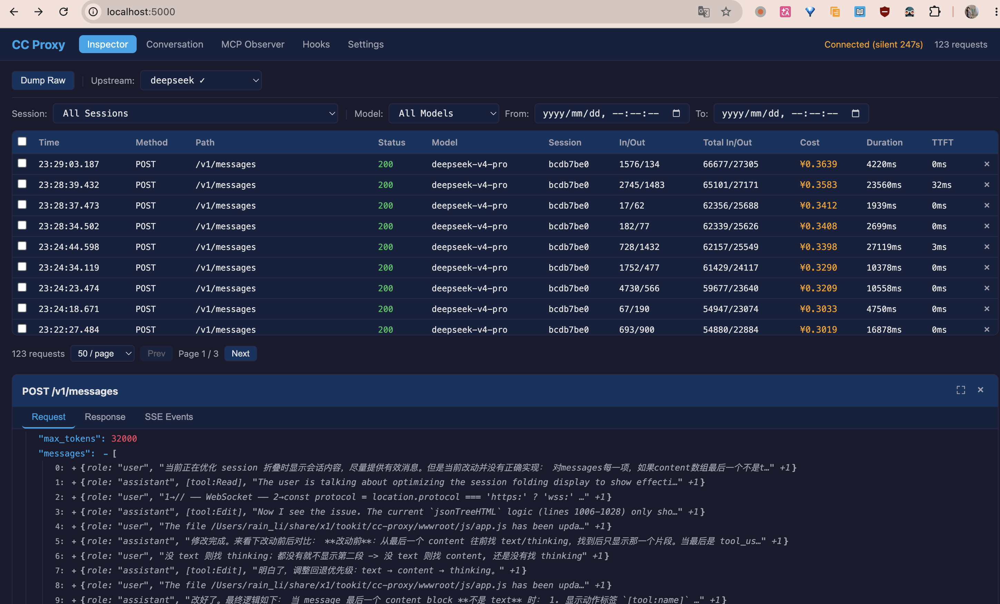

# CC Proxy

Transparent proxy for Claude Code API — intercept, visualize, and analyze API traffic from AI Coding Agents.

> [:cn: 中文版本](./README.md)



## Features

### 1. Web-based Configuration, Seamless Provider Switching Mid-Session

All Provider, Upstream, and Tier routing for Claude Code is managed through the **web dashboard** — no config file editing or proxy restarts needed. Switch upstream providers **within the same session** — use Opus for complex tasks, Haiku or DeepSeek for simple ones, balancing performance and cost. Supports not only different models within the same provider, but also **cross-provider combinations** (e.g. High tier → Anthropic Opus, Low tier → DeepSeek). The proxy auto-routes requests to the correct provider based on the model ID.

### 2. Real-Time Interaction Tracking

WebSocket pushes the full lifecycle of every API request — from initiation, streaming SSE events, to Hook triggers and MCP tool calls — all visible in real time. The live session view mixes API + Hook + MCP events on a unified timeline, recreating Claude Code's actual execution flow.

### 3. Readable Session Content

Click any Session to view structured content in the Summary panel: User Prompts, Assistant Actions (tool calls), Touched Files (file read/write stats), and Final Response. Export sessions as JSON/YAML, or batch-flush to the `sessions/` directory for offline review.

### 4. Real-Time Cost Tracking

Configurable model pricing (input / cache-write / cache-read / output, USD per million tokens) enables real-time cost calculation per request. The session management toolbar shows **today/this month** token consumption and cost summaries. The standalone Cost view supports multi-dimensional aggregation by date range, Model, Session, and Provider.

### 5. Post-Mortem Analysis

All requests and sessions are persisted in a local SQLite database. Review complete interaction histories of past Sessions — problem-solving approaches, tool-call chains, and file modification scopes — to summarize and improve your Claude Code skills.

---

## Quick Start

### 1. Download Pre-built Release (Recommended)

Download the platform-appropriate archive from [GitHub Releases](https://github.com/mushuanli/cc-proxy/releases), extract to get 3 files:

| File | Purpose |
|------|---------|
| `proxy-server` / `proxy-server.exe` | Main proxy binary |
| `config.toml` | Proxy config template — edit in your Provider API Keys, then manage visually from the dashboard |
| `settings.json` | Claude Code config — see step 3 |

```bash
# 1. Edit config.toml with your API Key
# 2. Start
./proxy-server config.toml          # macOS / Linux
proxy-server.exe config.toml        # Windows
```

> **Upgrade note**: Back up `config.toml` and `data.db` before upgrading to avoid losing configuration or history.

### 2. Build from Source

Requires Rust 1.80+

```bash
git clone git@github.com:mushuanli/anki-tookit.git
cd cc-proxy

cargo build -p proxy-server --release
cargo run -p proxy-server --release -- config.toml
```

### 3. Configure Claude Code

**Option A: One-command setup (recommended)**

```bash
./proxy-server --install               # Uses default proxy port 8888
./proxy-server --install --port 8888   # Explicit port
```

This modifies `~/.claude/settings.json` automatically (backs up to `settings.json.bak` first; subsequent runs create `.bak.1`, `.bak.2`, ...), writing:

| Field | Value |
|-------|-------|
| `ANTHROPIC_BASE_URL` | `http://localhost:8888` |
| `ANTHROPIC_AUTH_TOKEN` | `sk-dummy` |
| `ANTHROPIC_MODEL` | `claude-sonnet-pro[1m]` |
| `ANTHROPIC_SMALL_FAST_MODEL` | `claude-sonnet-flash[1m]` |
| `ANTHROPIC_DEFAULT_OPUS_MODEL` | `claude-opus-pro[1m]` |
| `ANTHROPIC_DEFAULT_SONNET_MODEL` | `claude-sonnet-flash[1m]` |
| `ANTHROPIC_DEFAULT_HAIKU_MODEL` | `claude-haiku-flash[1m]` |
| `CLAUDE_CODE_SUBAGENT_MODEL` | `claude-sonnet-pro[1m]` |

```bash
# To revert, uninstall removes the above fields (also backs up first)
./proxy-server --uninstall
```

**Option B: Manually override settings.json**

```bash
cp ~/.claude/settings.json ~/.claude/settings.json.bak   # backup
cp settings.json ~/.claude/
```

Alternatively, manually add key environment variables to your existing `settings.json`:

```json
"env": {
    "ANTHROPIC_BASE_URL": "http://localhost:8888",
    "ANTHROPIC_AUTH_TOKEN": "sk-dummy"
}
```

> **Windows users**: `settings.json` is under `%USERPROFILE%\.claude\`.

### 4. Open Dashboard

Visit **http://localhost:5000** in your browser.

---

## Workflow

```
Claude Code ──► :8888 proxy ──► Upstream Provider (Anthropic / DeepSeek / custom)
Browser     ──► :5000 dashboard ──► view requests live, switch providers, check costs
Claude Code ──► :9999 MCP proxy
```

### Configuring Providers

1. Dashboard → **Settings** → **Providers** panel
2. Click **+ Add**, fill in name, API URL, API Key
3. Add models with four-field pricing (in / cache-write / cache-read / out, USD/M tokens)
4. Add multiple providers as needed (Anthropic, DeepSeek, third-party proxies, etc.)

### Configuring Tier Routing

1. Settings → **Upstreams** panel → click **+ Add**
2. Configure four-tier routing:
   - **High** — matches keywords like `opus` → routes to specified Provider/Model
   - **Mid** — matches keywords like `sonnet`
   - **Low** — matches keywords like `haiku`
   - **Default** — fallback when nothing matches
3. Click **Activate** or use the dropdown at the top of session management to switch instantly

### Viewing Costs

- **Cost** column in the session management table shows per-request cost in real time
- Toolbar displays **today/this month** token usage and cost summaries
- **Cost** tab supports analysis by date range, Model, Session, and Provider

### Viewing Session Content

- Click a Session row → right-side **Summary panel** shows User Prompts, Assistant Actions, Touched Files, Final Response
- In-panel actions: Rename / Export (JSON/YAML) / Delete
- **Live Session** tab — mixed API + Hook + MCP timeline, filterable by Session

---

## Dashboard Tabs

| Tab | Function |
|-----|----------|
| **Sessions** | Request table (paginated/filtered/multi-select delete), Session grouping with collapse, inline detail (Request/Response/SSE), Upstream/Effort selectors, Cost stats, Summary panel |
| **Cost** | Cost analysis — date presets (Today/Week/Month), summary cards, breakdown by Model/Session/Provider |
| **Settings** | Full-width accordion with 4 panels: Model Pricing (standalone CRUD) + Providers + Upstreams + Data Retention |
| **Live Session** | Real-time timeline (API + Hook + MCP mixed), filter by Session, max 100 entries |
| **MCP Observer** | MCP JSON-RPC request list + target address config |
| **Hooks** | Hook event table (Event/Session/CWD/ExitCode), max 200 entries |

---

## Ports

| Port | Purpose |
|------|---------|
| **5000** | Dashboard SPA + REST API + WebSocket |
| **8888** | Anthropic API transparent proxy |
| **9999** | MCP JSON-RPC transparent proxy |

---

## Config Reference

```toml
# config.toml
[logging]
level = "info"

[proxy]
active_upstream = "deepseek"

[[proxy.providers]]
name = "deepseek"
url = "https://api.deepseek.com/anthropic"
token = "sk-xxx"

[[proxy.providers.models]]
id = "deepseek-v4-pro"
price_per_million_input = 3.0
price_per_million_cache_write = 3.75
price_per_million_cache_read = 0.3
price_per_million_output = 6.0

[[proxy.upstreams]]
name = "deepseek"
default_provider = "deepseek"
default_model = "deepseek-v4-pro"

[proxy.upstreams.high]
keywords = ["opus"]
provider = "deepseek"
model = "deepseek-v4-pro"

[server]
http_port = 5000
proxy_port = 8888
mcp_proxy_port = 9999
listen_address = "127.0.0.1"
```

See `config.toml.template` for detailed configuration.

---

## Security

- All ports listen on `127.0.0.1` only
- `x-api-key` and `Authorization` headers are auto-redacted to `[REDACTED]`
- API tokens stored in local TOML file; frontend only shows `has_token: bool`
- Data stored in local SQLite (`data.db`), not exposed externally

## License

MIT
