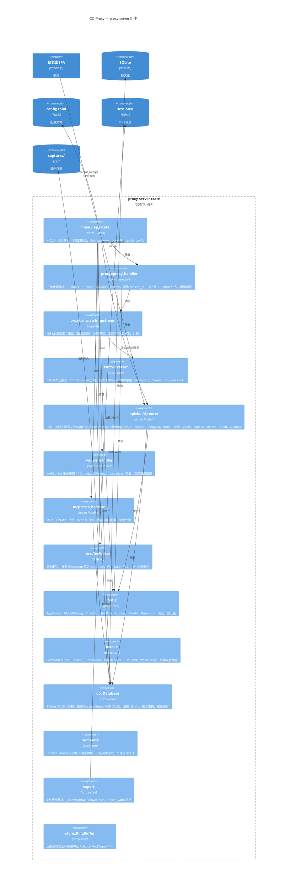

# C4 Level 3 — 组件图（proxy-server）



## 组件交互矩阵

| 调用方 | 被调用方 | 关系 |
|--------|---------|------|
| `main` | `proxy_handler` | 路由 HTTP :8888 请求 |
| `main` | `api_handler` | 路由 HTTP :5000 请求 |
| `main` | `ws_handler` | 路由 WS :5000 升级 |
| `main` | `mcp_handler` | 路由 HTTP :9999 请求 |
| `proxy_handler` | `dispatch` | 执行上游请求 |
| `proxy_handler` | `config` | Tier 路由、模型翻译、effort |
| `dispatch` | `sse_parser` | 流式响应时解析 SSE |
| `dispatch` | `db` | 持久化请求和 SSE 事件 |
| `api_handler` | `db` | 全部数据查询和 CRUD |
| `api_handler` | `config` | 读取/验证配置 |
| `ws_handler` | `db` | 读取首态（Hook、MCP 历史） |
| `main` | `config` | 加载 → 验证 → 持久化 |
| `export` | `db` | 读取 session 请求列表（含 body） |

## proxy-core 公共接口

```
config:  AppConfig, ModelPricing, Provider, TierRule, UpstreamConfig,
         ProxyConfig, ServerConfig, Retention, ResolvedPrice
models:  ProxiedRequest, Session, SessionStatus, HookEvent, McpRequest,
         SseEvent, WsMessage, HasId, CostData, ModelCost, ProviderCost,
         SessionCost, DailyCost, ProviderInfo, UpstreamInfo, TierRuleInfo
db:      Database, DbError, db_error, extract_latest_user_prompt
sse:     SseParser
export:  export_json, export_har, export_markdown, export_yaml,
         flush_yaml, read_yaml_meta
summary: analyze_request, SessionSummary, UserPrompt, AssistantAction,
         FileOperation, SessionStats
store:   RingBuffer<T>
```
