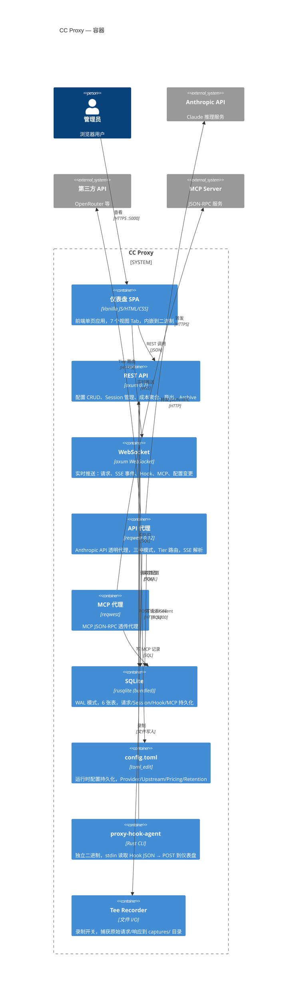

# C4 Level 2 — 容器图

## 容器职责

| 容器 | 端口 | 技术 | 说明 |
|------|------|------|------|
| **仪表盘 SPA** | :5000（静态文件） | Vanilla JS | 7 个视图，rust-embed 内嵌 |
| **REST API** | :5000 | axum 0.7 | ~40 个端点，配置 CRUD + 数据查询 |
| **WebSocket** | :5000 (/ws) | axum WS | 18 种消息类型，10s ping，broadcast 频道 |
| **API 代理** | :8888 | reqwest 0.12 | CONNECT/Forward/Reverse 三种模式，SSE 解析，重试 |
| **MCP 代理** | :9999 | reqwest | JSON-RPC 透传 |
| **SQLite** | 本地文件 | rusqlite (bundled) | WAL 模式，6 张表，busy_timeout 5s |
| **config.toml** | 本地文件 | toml_edit | 保留格式和注释的持久化 |
| **hook-agent** | 独立 CLI | reqwest + clap | stdin → POST，静默失败 |
| **Tee Recorder** | 本地文件 | 标准 I/O | 按日期+session 组织，合并 SSE 内容块 |
