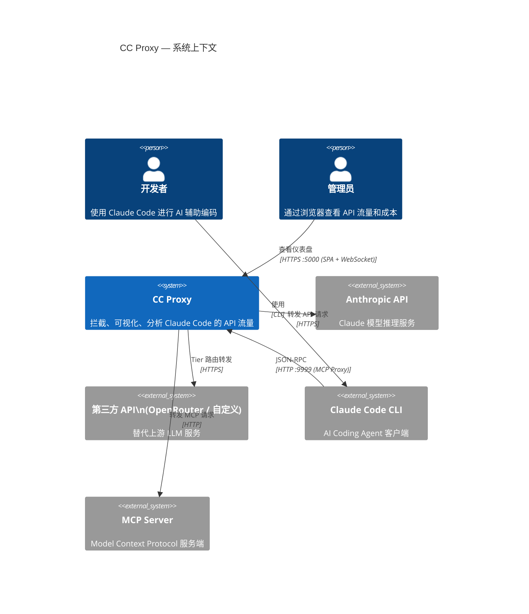

# C4 Level 1 — 系统上下文图

## 说明

| 角色 | 描述 |
|------|------|
| **开发者** | 日常使用 Claude Code 的软件工程师，通过设置 `ANTHROPIC_BASE_URL` 环境变量将流量指向代理 |
| **管理员** | 通过浏览器打开仪表盘，查看实时请求、session 摘要、成本分析，管理配置 |
| **CC Proxy** | 透明代理核心，3 端口架构，SQLite 持久化 |
| **Anthropic API** | 默认上游，Claude 模型官方 API |
| **第三方 API** | OpenRouter 等兼容 Anthropic API 格式的第三方服务 |
| **Claude Code CLI** | Anthropic 官方 AI Coding Agent，发起 API 请求 |
| **MCP Server** | MCP 协议服务端，提供工具扩展 |
