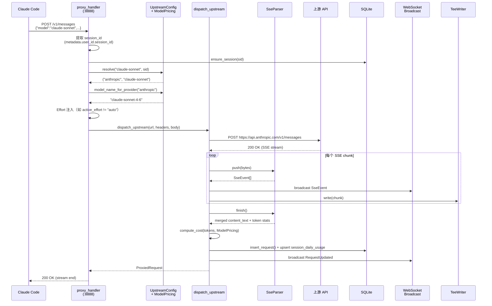
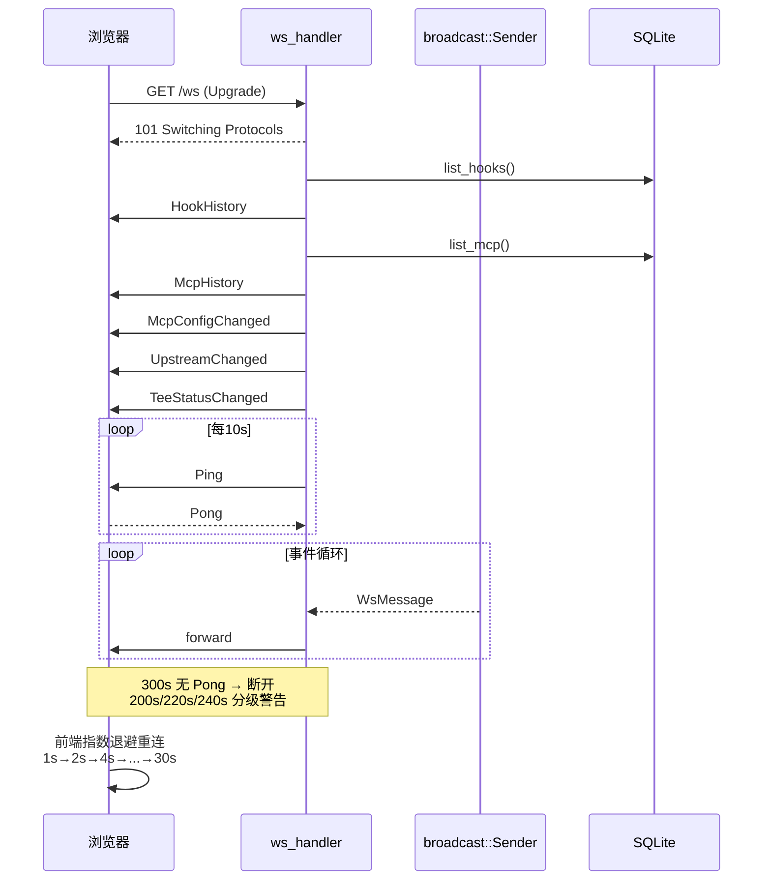
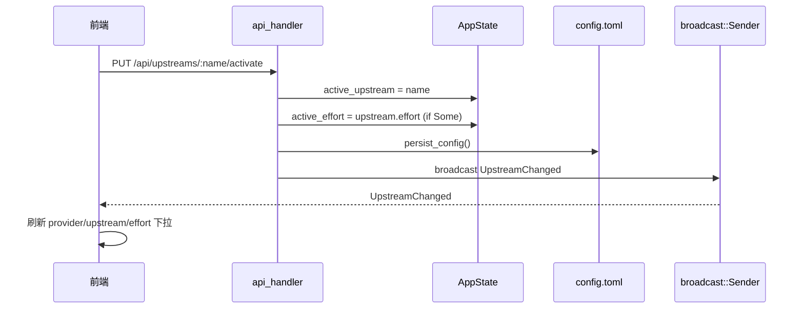
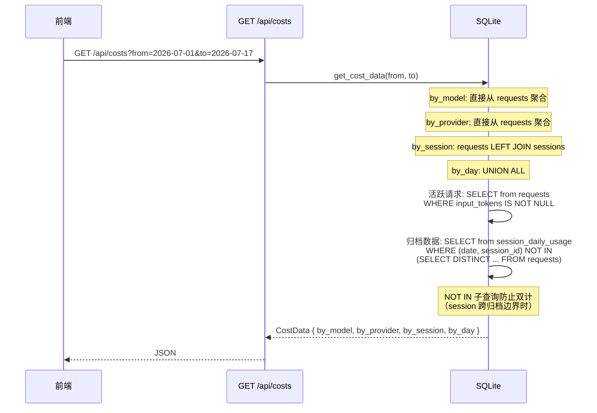

# C4 Level 4 — 动态图

## 请求代理流程（Reverse Proxy 模式）



## 数据清理流程

```mermaid
sequenceDiagram
    participant Loop as cleanup_loop<br/>(每30min)
    participant DB as SQLite
    participant Export as export::flush_yaml
    participant Dir as sessions/

    Loop->>DB: sessions_with_old_requests(hours, keep_sid)
    DB-->>Loop: [sid1, sid2, ...]

    Note over Loop,Export: Pre-flush: 先归档再清理

    Loop->>DB: list_requests_with_body(sid)
    Loop->>Export: flush_yaml(session, requests)
    Export->>Dir: write sessions/<sid>.yaml

    Note over Loop,DB: cleanup_old_requests 6步

    Loop->>DB: Step 1: 聚合 token 到 sessions 表
    Loop->>DB: Step 1.5: 生成 summary_json
    Loop->>DB: Step 1.6: INSERT OR REPLACE session_daily_usage
    Loop->>DB: Step 1.7: 标记 Archived + ended_at
    Loop->>DB: Step 2: 保留最新请求（tombstone）
    Loop->>DB: Step 3: DELETE 其余旧请求

    Loop->>DB: cleanup_old_sessions(max_count)
    Loop->>DB: delete_old_sessions_by_age(days)
```

## WebSocket 连接生命周期



## 配置变更流程



## Cost 查询去重逻辑


