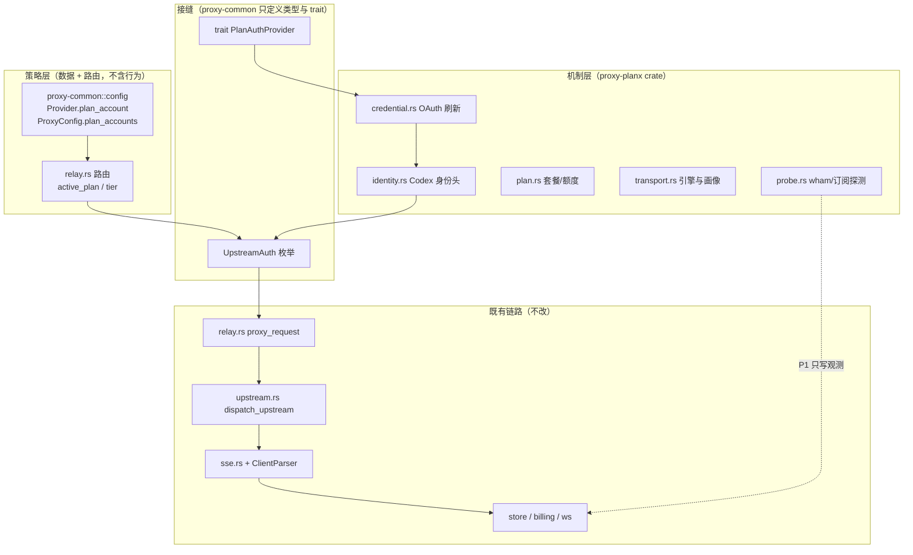

# Planx — GPT Plan 订阅账号接入方案

> 状态：**P0 已实施**（P0-a 配置往返修复 + P0-b 凭据/身份机制）
> 目标读者：cc-proxy 维护者
> 相关：`priv/plan2api`（独立的单账号 Rust 实现，本文评估其中哪些部分值得收割）

## 实施状态

| 项 | 状态 | 落点 |
|---|---|---|
| P0-a 配置往返修复 | ✅ | `config/persist.rs`、`web/settings.rs`、`models.rs` |
| P0-b `proxy-common` 接缝 | ✅ | `src/auth.rs`、`config/account.rs`、`config/provider.rs`、`config/config.rs`、`config/validation.rs` |
| P0-b `proxy-planx` 机制 | ✅ | `crates/proxy-planx/`（jwt / credential / identity / transport / registry） |
| P0-b relay 接线 + 401 当次重试 | ✅ | `proxy-relay/src/upstream.rs`、`relay.rs` |
| P0-b server 装配 + `impersonate` feature | ✅ | `proxy-server/src/main.rs`、`Cargo.toml` |
| **P0-c 统一账号模型：两家族 × 两模式** | ✅ | `config/account.rs`、`identity.rs`、`credential.rs`、`registry.rs` |
| P1 额度可观测性（后端机制） | ✅ | `proxy-planx/src/probe.rs`、`web/settings.rs` 5 个 handler |
| P1 账号 CRUD API | ✅ | `GET/POST /api/accounts`、`PUT/DELETE /api/accounts/:name`、`POST /api/accounts/:name/probe` |
| P1 热重载（无需重启） | ✅ | `PlanxRegistry::reload` + `spawn_config_watcher`（API 事件 + 磁盘 mtime 双触发） |
| P1 前端账号界面 | ✅ | `wwwroot/js/accounts.js`、`index.html`、`assets/zh.json`、`settings.css` |
| P1 热重载自动化测试 | ✅ | `crates/proxy-server/src/watcher.rs`（6 个测试） |
| P2 `ProtocolAdapter` 接缝 | ✅ | `proxy-common/src/protocol.rs`（3 个测试） |
| P2 Anthropic→Responses 请求翻译 | ✅ | `proxy-bridge/src/lib.rs`（14 个测试） |
| P2 Responses SSE→Anthropic SSE 响应翻译 | ✅ | `proxy-bridge/src/stream.rs` |
| P2 反向：Responses→Messages 请求翻译 | ✅ | `proxy-bridge/src/lib.rs`（`responses_to_messages`） |
| P2 反向：Anthropic SSE→Responses SSE 响应翻译 | ✅ | `proxy-bridge/src/reverse.rs` |
| P2 relay 接线 | ✅ | `proxy-relay` 转发路径 + stream 循环 + `relay.rs` 桥接判定 |

**验证结果**：默认 feature 与 `--features impersonate`（BoringSSL/wreq）均编译通过；
工作区测试 **280 passed / 0 failed**（基线 106，新增 174）；
本次改动的文件 clippy 无告警（仓库另有既存告警，未触碰）。

### 账号模型：两家族 × 两模式

原计划只覆盖「GPT × plan」，现已泛化为统一账号模型——**两个家族、两种模式都支持**：

| family | `mode = api_key` | `mode = plan` |
|---|---|---|
| `gpt`（ChatGPT / Codex） | 静态密钥 → `Bearer`（`sk-`）/ `x-api-key` | Codex OAuth + Codex CLI 身份 |
| `claude`（Anthropic） | 静态密钥 → **`x-api-key`** | Claude OAuth + Claude Code 身份 + 合并 `oauth-2025-04-20` |

关键设计调整（相对本文原始方案）：

1. **`UpstreamAuth` 不再有「plan」概念**。原 `Plan { access_token, extra_headers }`
   把「订阅」写进了接缝里；现改为 `Headers { set, append }` —— relay 只负责
   「把这些头写上去」，**凭据放哪个头是机制层按家族决定的**。
   这样 `api_key` 与 `plan` 两种模式、两个家族走完全相同的 relay 路径。
2. **新增 `append` 语义**。Claude 订阅凭据必须声明 `oauth-2025-04-20`，
   但客户端可能已带 `claude-code-20250219` 等 beta，必须**合并而非覆盖**。
   `apply_auth` 因此区分 set（覆盖）与 append（逗号合并且去重）。
3. **族别校验**。`identity` 配成对方家族的画像会被忽略并回落到本家族默认值，
   避免「codex 的 UA + Anthropic 端点」这类错配指纹。
4. **`api_key` 模式的头部放置按家族区分**。Anthropic API key 必须进
   `x-api-key`（发成 Bearer 会被拒），GPT 沿用既有 `sk-` → Bearer 规则。
   注意这条只作用于新账号路径，`Provider.token` 的旧启发式**未改动**。
5. **`auth_json` / `persist` 仅 gpt**。Claude 的凭据由 Claude Code 自己管理
   （keychain），没有可移植文件可回写；配置了会被校验拒绝。
6. **Claude 身份头**按官方客户端实测构造：`claude-cli/<ver> (external, cli)` +
   `x-app: cli` + `x-stainless-{lang,package-version,os,arch,runtime,runtime-version}`。
   `x-stainless-*` 从与 Go 版相同的候选池中按账号种子**确定性**挑选
   （同账号稳定、跨账号分散，且无需落库）。
7. **刷新请求按家族分派**：GPT 用 form-urlencoded 且带 scope；
   Claude 用 JSON 且**不带 scope**（RFC 6749 §6 继承原授权）。


### P1 实施记录：额度可观测性 + 热重载

**两个探测端点**（均零消耗，不影响额度）：

| family | 端点 | 凭据要求 |
|---|---|---|
| GPT | `GET chatgpt.com/backend-api/wham/usage` | 任意 ChatGPT OAuth token |
| Claude | `GET api.anthropic.com/api/oauth/usage` | **需要 `user:profile` scope** —— `setup-token`（`sk-ant-oat01-…`）只有推理权限，会被拒（返回 403 时错误信息里直接写明原因） |

归一化为 `AccountQuota { plan, windows[], credits_*, reset_credits, limit_reached, probed_at, error }`，
window 统一成 `{name, label, utilization, resets_at, model_scoped}`：

- GPT 的 `primary_window`/`secondary_window` 按 `reset_after_seconds` 归成 `5h`/`7d`；
  没有 `reset_at` 时用 `now + reset_after_seconds` 兜底。
- Claude 的 `five_hour`/`seven_day` 直接映射；`limits[]` 里 `group = weekly` 的按模型族
  归成 `7d_fable` 等，**Fable 5 与 5.1 合并为同一个桶**（上游就是共享的周额度）。
- 两个上游都会把数字混用 int/float/字符串，因此数值与时间戳都用宽容反序列化。
- **探测失败不返回 `Err`，而是把错误放进 `AccountQuota.error`** —— 一个账号探测失败
  不应该让整个列表挂掉。

**热重载**：`PlanxRegistry` 内部改为 `RwLock<HashMap<..>>`，可**原地重建**，
因此 relay 持有的 `Arc<dyn PlanAuthProvider>` 句柄始终有效 —— 不需要换句柄、不丢请求。

`reload()` 的语义（有测试守住）：

- 配置**逐字段相等**的账号保留原 `PlanAccount`，即保留已刷新的凭据、刷新状态与额度快照
  （用 `Arc::ptr_eq` 断言）；
- 配置变了的账号重建；
- 被移除的账号下线；
- **新配置非法时保留旧账号继续服务** —— 运维打错字不会让可用账号掉线。

两个触发源汇聚到同一条重载路径：

1. **面板编辑** → 发 `UpstreamChanged` 事件（复用既有事件，不新增 WS 消息类型，前端无感）；
2. **手改 config.toml** → `spawn_config_watcher` 每 2s 轮询 mtime。

> 实施中发现：在此之前**没有任何代码调用 `ConfigStore::reload()`**，也没有文件监听，
> 所以手改 `config.toml` 一律需要重启。只做 (1) 是不够的 —— 面板 API 存在但当时还没有
> 前端界面，等于「热重载」在实际使用中触达不到。`reload()` 本身会先校验再替换，
> 非法配置会报错并保留旧配置，因此轮询是安全的。


### P2 实施记录：协议翻译（内核完成，**尚未接线**）

目标：让 Claude Code（Anthropic Messages）骑 GPT plan（OpenAI Responses）。

**接缝**（`proxy-common/src/protocol.rs`）—— 与 planx 相同的 DI 模式：

```text
proxy-common   trait ProtocolAdapter / ResponseTranslator   策略与形状
proxy-bridge   具体 Anthropic ⇄ Codex 翻译                  机制
proxy-relay    在 client protocol != upstream protocol 时调用  消费者
proxy-server   构建并注入                                     装配
```

响应翻译之所以是**有状态对象**而非纯函数：客户端协议要求「恰好一次
`message_start`、单调递增的 content-block index、结尾必须有 `message_stop`」，
这天然是状态机。`ResponseTranslator::push()` 逐帧进、多帧出，`finish()` 收尾。

**覆盖范围**：

| 元素 | 请求 | 响应 |
|---|---|---|
| system prompt | ✅ → `instructions` | — |
| 文本消息 | ✅ | ✅ |
| 工具定义 / `tool_choice` | ✅ | — |
| assistant `tool_use` | ✅ → `function_call` | ✅ ← `function_call` |
| user `tool_result` | ✅ → `function_call_output` | — |
| base64 / url 图片 | ✅ → `input_image` | — |
| usage（含 cached tokens） | — | ✅ |
| thinking / redacted 块 | 丢弃（Responses 无对应表示） | — |

**实现中发现并记录的两个真实约束**：

1. **`message_start` 里的 `input_tokens` 只能是 0**。Responses 只在终止事件
   （`response.completed`）里报 usage，而 `message_start` 必须出现在第一个文本
   delta 之前。因此权威的 input/cache 计数在 `message_delta` 的 `usage` 里重复一次，
   让累加 usage 的客户端仍能得到正确总数。这是协议能力差异，不是实现偷懒。
2. **`stop_reason` 需要推断**。Responses 的 `status` 只有 `completed` / `incomplete`，
   而 Anthropic 要区分 `end_turn` / `tool_use` / `max_tokens`。规则：出现过
   `function_call` → `tool_use`；`incomplete` + `max_output_tokens` → `max_tokens`；
   否则 `end_turn`。

**接线（已完成）**：

1. `RelayHandler` 增加 `protocol_adapter` 字段 + `with_protocol_adapter()`；
2. `upstream::plan_bridge()` 决定是否需要桥接：provider 服务客户端协议 → 不桥接
   （**`protocols` 为空的 provider 仍然「服务一切」，因此既有配置行为不变**）；
   否则若 provider 服务另一协议且 adapter 覆盖该方向 → 桥接到那一侧；
3. 桥接时 `translate_request` 换 body、路径换成目标协议的默认路径
   （Anthropic→Codex 即 `/responses`），`provider_url` 也按**上游真实协议**选
   `codex_url`；
4. 翻译器作为**独立参数**传入 `stream_upstream_response` /
   `handle_non_streaming_response`（而不是塞进 `StreamCtx`），从而不动
   `StreamCtx` 的 `Clone` 派生；
5. stream 循环里 `parser.feed()` 只切一次帧：有翻译器时发送翻译后的帧，
   否则原样转发 chunk。**上游协议的解析路径完全不变** —— 计费、捕获、
   Session observation 都仍按上游协议工作；
6. 非流式在解析前先 `translate_complete()`，于是下游所有消费者
   （usage 提取、归一化、捕获、计费）拿到的都是**客户端协议**的形状。

**接线的端到端验证**（真实起服务 + 假 Codex 上游）：

```
发出   POST /v1/messages  {system:"be terse", messages:[...], stream:false}
收到   /responses        {instructions:"be terse", input:[{type:message,...}],
                          model:"gpt-5", max_output_tokens:100, store:false}
客户端 {type:"message", content:[{type:"text",text:"hello from codex"}],
        stop_reason:"end_turn", usage:{input_tokens:12,output_tokens:4,cache_read_input_tokens:3}}

流式（stream=true）客户端收到 7 个事件，顺序完全符合 Anthropic 规范：
  message_start → content_block_start → content_block_delta ×2
  → content_block_stop → message_delta → message_stop
  message_delta 携带 stop_reason=end_turn 与完整 usage
```

**接线中发现并修掉的两个真实 bug**：

1. **`content-length` 必须剥离**。翻译改变了 body 字节数，但上游的
   `content-length` 被原样转发，导致 hyper 直接 panic：
   `payload claims content-length of 243, custom content-length header claims 255`。
   现在只要有翻译就剥离 `content-length` / `content-encoding`
   （流式与非流式都做）。
2. **上游忽略 `stream: true` 时客户端会收到空流**。假上游暴露了这个场景：
   它返回普通 JSON，而流式翻译器只在 SSE 帧上工作，于是一个事件都不发。
   现在 `ResponseTranslator` 增加 `stream_from_complete()`，在整条流里
   **一个翻译帧都没产生**时，把完整 body 渲染成 SSE 事件序列
   （`message_to_sse()`）。两个方向都有测试。

### 实施中发现的其他偏差

1. **`AppConfig` / `ProxyConfig` 是 `pub(crate)`**，跨 crate 不能命名。
   实际做法：`proxy-server` 通过类型推断访问 `config_snapshot.proxy.accounts`
   （字段是 `pub`），只把 `AccountConfig` 显式 `pub` 导出。
2. **同步 trait 的正确实现方式**：最初想在 `resolve()` 里用
   `block_in_place` + `Handle::block_on` 读异步 token store —— 这会在
   `current_thread` runtime 上 panic，且阻塞 worker。改为：
   `PlanAccount` 维护一份 **`std::sync::RwLock<Option<UpstreamAuth>>` 同步快照**，
   由凭据变化时重新发布；`resolve()` 只是一次 `try_read`。异步刷新完全在后台任务里。
3. **认证材料不含会话头**。`session-id` / `thread-id` 是**逐请求**状态，
   而 auth 是**逐账号**缓存；把它塞进 auth 会让所有请求共用同一会话。
   会话头继续由 relay 从下游原样转发（保住 Session 视图与上游 thread 的 1:1 对应）。
4. **`build_upstream_headers` 旧函数与旧签名完全未动**，新函数在其之上分层，
   并有逐字节等价测试（`static_auth_is_byte_identical_to_the_legacy_builder`）。
5. **401 重试用就地换认证**（`apply_auth_to`）而非重建 header 集，
   否则会丢掉初次构建之后才插入的 `anthropic-beta` effort 头。
6. **workspace 没有 `http2` feature**（`proxy-relay` 的 reqwest 也没开），
   因此 planx 的维护客户端同样不启用，避免静默改变传输行为。
7. **账号配置在启动时加载一次**，面板改动需重启生效 —— P0 已知限制，
   接 `ConfigStore` 变更事件重建 registry 属于 P1。

---

## 0. 结论摘要

**planx 要解决的问题**：cc-proxy 的上游凭据目前只有「静态 API token」一种形态，
无法把 **ChatGPT / Codex 订阅账号（OAuth）** 当作上游使用。

**三个关键判断**：

1. **不需要新增 `ApiProtocol`。** planx 上游说的就是既有的 `codex` 协议
   （Codex Responses），因此 `detect_protocol` / `make_parser` / `normalize_response_body` /
   `message_count` / `extract_request_session_id` / `client_type` 这 **6 处协议分支零改动**。
   这是整个方案能做到「非侵入」的根本原因。

2. **只动一层：凭据获取 + 出站身份头。** 现有代码里这两件事收口在极少数地方——
   凭据解析 `relay.rs:416`、认证头注入 `upstream.rs:38`（调用点 `relay.rs:513`）。
   改造面 = **1 个新 crate + 2 处插入 + 1 处装配**。

3. **不能整体合入 `priv/plan2api`。** 它与 cc-proxy 的重叠约 60%
   （HTTP 网关、配置、SSE 解析、错误类型都已有等价物）。
   只收割 5 个 mechanism 模块，丢弃 6 个。详见 §2。

**分阶段**：P0（凭据+身份，~350 行新代码，零协议改动）→ P1（plan 可观测性）
→ P2（Anthropic→Codex 翻译，让 Claude Code 也能用 plan，这才是侵入较大的部分）。

---

## 1. 现状盘点

### 1.1 cc-proxy 已有的、可直接复用的接缝

| 能力 | 位置 | 说明 |
|---|---|---|
| Codex 协议识别 | `crates/proxy-relay/src/upstream.rs:91` `detect_protocol` | `/responses` 或 body 含 `input` 无 `messages` → `ApiProtocol::Codex` |
| Codex 专用上游选择 | `crates/proxy-relay/src/relay.rs:311-317` | `active_plan`，空则回落 `active_upstream` |
| 每 Provider 的 Codex 端点 | `crates/proxy-common/src/config/provider.rs:24` `codex_url` | 解析点 `relay.rs:409-413` |
| 协议准入 | `crates/proxy-common/src/config/provider.rs:30` `Provider::serves` | 门禁在 `relay.rs:394-406` |
| **凭据解析（唯一）** | `crates/proxy-relay/src/relay.rs:416` | `let provider_token = provider.and_then(\|p\| p.token.clone());` |
| **认证头注入（唯一）** | `crates/proxy-relay/src/upstream.rs:38` `build_upstream_headers` | `sk-` → `Authorization: Bearer`，否则 `x-api-key`；调用点 `relay.rs:513` |
| 传输机制 | `crates/proxy-relay/src/upstream.rs:286` `dispatch_upstream` | 纯 HTTP + 指数退避重试，协议无关 |
| Codex 会话/用量观测 | `crates/proxy-session/src/source/codex.rs:20` `CodexParser` | `ClientParser::feed_sse` `:27`；用量解析 `upstream.rs:706-721` |
| **可选机制注入的既有范式** | `crates/proxy-relay/src/relay.rs:68` | `session_ingest: Option<Arc<dyn SessionIngest>>` ← **planx 照抄这个模式** |
| 同步 trait + Ext 范式 | `crates/proxy-session/src/ingest/mod.rs:13,31` | `trait X: Send + Sync` + `Option<Arc<dyn X>>` 的扩展 trait |
| 健康/非流式归一 | `crates/proxy-relay/src/upstream.rs:723` `normalize_response_body` | 已含 Codex `output[]` 分支 |

> 结论：cc-proxy **已经是一个 Codex 可感知的代理**。planx 不需要教它认识 Codex，
> 只需要换掉「凭据从哪来」。

### 1.2 真正的缺口

| 缺口 | 证据 | 影响 |
|---|---|---|
| 认证只有静态 token | `upstream.rs:38-73` 只处理 `sk-` 前缀与 `x-api-key` | 无法用订阅账号 |
| 无 OAuth 刷新 | 全仓无 `oauth/token`、无 refresh 逻辑 | access_token 过期即 401 |
| 无出站身份伪装 | `build_upstream_headers` 只做 header 透传/替换 | 缺 `originator` / `Version` / 会话头，上游按非官方客户端处理 |
| 无请求级 header 钩子 | `build_upstream_headers` 签名只收 `Option<&str>` | 需要扩签名（但可向后兼容，见 §5） |
| 无 plan 额度可观测性 | 无 wham / subscription 概念 | 面板看不到 5h/7d 余量，无法做用量告警 |

---

## 2. 与 `priv/plan2api` 的重叠分析：只收割，不整体合入

`plan2api` 是一个**独立可运行的单账号网关**（含自己的 axum server、配置、bin）。
cc-proxy 已经拥有这些能力，整体合入会造成两套配置、两套 server、两套错误类型。

| plan2api 模块 | cc-proxy 等价物 | 处置 | 理由 |
|---|---|---|---|
| `src/auth.rs`（OAuth 刷新 / JWT plan / auth.json 读写） | **无** | ✅ 收割 → `credential.rs` + `jwt.rs` | 这是 planx 的核心价值 |
| `src/identity.rs`（UA / Originator / 会话头 / UUIDv7） | **无** | ✅ 收割 → `identity.rs` | 缺口 3 |
| `src/plan.rs`（套餐归一 / 订阅状态 / 5h·7d 窗口） | **无** | ✅ 收割 → `plan.rs` | P1 可观测性 |
| `src/httpc.rs`（引擎选择 reqwest/wreq + 画像） | **无** | ✅ 收割 → `transport.rs` | 可选 TLS 伪装 |
| `src/client.rs`（单账号上游客户端） | 部分（`dispatch_upstream`） | ⚠️ **瘦身收割** → `probe.rs` | 只保留 wham/订阅/清单**探测**（这些必须自带 HTTP 调用）；**`/responses` 的发送仍由 cc-proxy 完成**——避免双传输栈 |
| `src/error.rs` | `proxy-common` 的 `thiserror` 错误 | ⚠️ 适配 | 并入 `PlanxError` |
| `src/translate.rs`（Chat ↔ Responses） | **无** | 🔒 **暂存，P2 才用** | P0 不需要翻译 |
| `src/sse.rs` | `proxy-relay/src/sse.rs` `SseParser` | ❌ 丢弃 | 重复 |
| `src/wire.rs`（出站 body 收口） | 无，但 P0 也不需要 | ❌ 丢弃 | 保持报文透明 |
| `src/server.rs`（axum 网关） | `proxy-server` | ❌ 丢弃 | 重复 |
| `src/config.rs` + `src/bin/` | `proxy-common/config` + `proxy-server` | ❌ 丢弃 | 重复 |

**关键洞察**：planx 在 P0 阶段**不负责发送 `/responses`**。
它只回答一个问题——「这个上游请求应该带什么认证头？」——
请求发送、重试、SSE 解析、计费、录制全部留在 cc-proxy 原有路径。
这让 planx 从「网关」降级为「凭据与身份提供者」，是可控侵入的前提。

---

## 3. 目标架构

### 3.1 分层（策略 / 机制分离）



### 3.2 目录结构

```
crates/
├── proxy-common/                 # 仅「类型 + trait」，不引入任何 HTTP 依赖
│   └── src/
│       ├── auth.rs               # 新增：UpstreamAuth + trait PlanAuthProvider
│       └── config/
│           ├── provider.rs       # 改：+2 字段
│           ├── config.rs         # 改：ProxyConfig +1 字段
│           └── validation.rs     # 改：+1 校验
├── proxy-planx/                  # 新增：机制层，唯一的新 crate
│   └── src/
│       ├── lib.rs
│       ├── credential.rs         # 收割自 plan2api/src/auth.rs
│       ├── jwt.rs                # 收割自 plan2api/src/auth.rs（JWT 部分）
│       ├── identity.rs           # 收割自 plan2api/src/identity.rs
│       ├── plan.rs               # 收割自 plan2api/src/plan.rs
│       ├── transport.rs          # 收割自 plan2api/src/httpc.rs
│       ├── probe.rs              # 瘦身收割自 plan2api/src/client.rs
│       ├── registry.rs           # 新增：PlanAuthProvider 实现 + 后台刷新
│       └── error.rs
├── proxy-relay/                  # 只改 2 处插入
│   ├── src/upstream.rs           # +build_upstream_headers_with_auth（旧函数保留）
│   └── src/relay.rs              # 凭据解析 + 注入
└── proxy-server/                 # 只改装配
    └── src/main.rs               # 构造 PlanxRegistry 注入 RelayHandler
```

### 3.3 边界表

| 关注点 | 归属 | 说明 |
|---|---|---|
| 「哪些 Provider 用哪个 plan 账号」 | **策略** → `proxy-common/config` | 纯 serde 数据，可被前端 CRUD |
| 「access_token 怎么拿、何时刷、身份头长什么样」 | **机制** → `proxy-planx` | 不被 config 反向依赖 |
| 「认证头怎么套进 HTTP 请求」 | 接缝 → `proxy-common/auth.rs` | relay 只认 `UpstreamAuth`，不认 planx |
| 「请求发给谁、发什么 body」 | 既有 → `proxy-relay` | planx 不介入 |
| 「响应怎么解析、怎么计费」 | 既有 → `proxy-relay` + `proxy-session` | planx 不介入 |

### 3.4 与项目既有方向的一致性

cc-proxy 已经用 commit `a1293f1`（"support Codex CLI with strategy/mechanism separation"）
确立过同一套做法，planx 是它的延续而非新范式：

| 既有实践 | 位置 | planx 的对应 |
|---|---|---|
| 机制 trait + 单一 `dyn` 工厂 | `ClientParser` `source/mod.rs:54`，工厂 `make_parser` `upstream.rs:341` | `PlanAuthProvider` trait + `PlanxRegistry` 实现 |
| 可选机制以 trait object 注入 | `RelayHandler.session_ingest: Option<Arc<dyn SessionIngest>>` `relay.rs:68`，DI 于 `main.rs:84-94` | `RelayHandler.plan_auth: Option<Arc<dyn PlanAuthProvider>>` |
| 同步 trait + `Option<Arc<dyn>>` 扩展 | `SessionIngest` + `SessionIngestExt` `ingest/mod.rs:13,31` | 同形 |
| 策略（协议选择）与机制（解析）分离 | `detect_protocol` 只决定用哪个 parser | Provider 配置只决定用哪个凭据来源 |

> 也就是说：**planx 不引入新范式，只是给已有的「策略/机制分离」再加一个机制。**
> 这也是它能把改动压到 2 处插入的原因。


---

## 4. 最小侵入改动清单

> 行数为估算；「性质」列区分 **新增 / 追加 / 替换**。

### 4.1 新增 `crates/proxy-planx/`（约 700~900 行）

| 文件 | 来源 | 行数 |
|---|---|---|
| `credential.rs` + `jwt.rs` | plan2api `auth.rs`（518 行） | ~380 |
| `identity.rs` | plan2api `identity.rs`（434 行） | ~300 |
| `plan.rs` | plan2api `plan.rs`（1003 行，P0 可只取套餐归一 + 窗口结构） | ~200 |
| `transport.rs` | plan2api `httpc.rs`（231 行） | ~180 |
| `probe.rs` | plan2api `client.rs` 的 wham/订阅/清单部分（901 行 → 瘦身） | ~250 |
| `registry.rs` | 新增（trait 实现 + 后台刷新任务） | ~150 |
| `error.rs` / `lib.rs` | 适配 | ~80 |

依赖：`proxy-common`、`reqwest 0.12`（与 workspace 同版本同 features）、`tokio`、`serde`、`serde_json`、`chrono`、`thiserror`、`sha2`、`uuid`、`base64`、`tracing`。
可选 `impersonate` feature → `wreq` + `wreq-util`（见 §7.4）。

### 4.2 `crates/proxy-common`（配置：**必须同时改 4 个位置**）

> ⚠️ **前置阻塞项**：cc-proxy 的配置持久化是**手写的字段级 toml_edit writer**
> （`config/persist.rs:88-175`），不是 serde round-trip。
> 现状是 `protocols` / `codex_url` / `active_plan` **根本没被写进文件**
> （`persist.rs` 里 grep `codex|protocols` = 0 命中），
> 而 `ConfigStore::update → persist_config`（`config/store.rs:69`）是唯一持久化路径。
> **后果：只要在面板上改一次配置，这三个字段就会从 config.toml 里消失**
> （内存里还在，重启后丢失）。
>
> planx 新增的 `plan_accounts` / `plan_account` 若只加结构体不加 writer，
> 会**原样复现这个 bug**。因此本方案把「修好协议字段的往返」列为 P0 的第一步。

| 文件 | 改动 | 行数 |
|---|---|---|
| `src/auth.rs`（新增） | `UpstreamAuth` 枚举 + `PlanAuthProvider` trait | ~50 |
| `src/config/provider.rs:5` | `Provider` 追加 `plan_account: Option<String>`、`impersonate: Option<String>` | +6 |
| `src/config/config.rs:50` | `ProxyConfig` 追加 `plan_accounts: Vec<PlanAccountConfig>` + `PlanAccountConfig` 结构 | +30 |
| `src/config/persist.rs:88-175` | `write_proxy_section` **必须**写出新字段；顺带补齐 `active_plan` / `protocols` / `codex_url` | +40 |
| `src/config/validation.rs:5` | 校验 `plan_account` 引用存在、名称唯一；`token` 与 `plan_account` 互斥 | +30 |
| `src/config/mod.rs:17` | `PlanAccountConfig` 需 **public re-export**（现 `AppConfig`/`ProxyConfig` 是 `pub(crate)`，跨 crate 不能命名） | +2 |
| `src/web/settings.rs:286` + `src/models.rs:326` | 读路径补齐：`ProviderInfo` / `list_providers` 目前漏掉 `protocols`/`codex_url`，新字段同理需要 | +20 |
| `src/lib.rs` | `pub mod auth;` | +1 |

**兼容性**：新字段全部 `#[serde(default, skip_serializing_if = ...)]`，
旧 `config.toml` **反序列化**结果不变，无 DB 变更。
但**「序列化往返安全」在修好 `persist.rs` 之前不成立**——
这是 P0 的验收项之一（见 §9），不能想当然。


### 4.3 `crates/proxy-relay`（2 文件，2 处插入）

| 位置 | 改动 | 性质 |
|---|---|---|
| `src/upstream.rs:38` | 新增 `build_upstream_headers_with_auth(headers, Option<&UpstreamAuth>)`；**旧 `build_upstream_headers` 保留并委托给它**（`Static` 分支） | 追加 |
| `src/relay.rs:416` | 凭据解析：有 `plan_account` 时向 `PlanAuthProvider` 取 `UpstreamAuth`，否则维持 `Static(token)` | 替换 1 行 → ~10 行 |
| `src/relay.rs:513` | 调用新函数 | 替换 1 行 |
| `src/relay.rs:68` + `new()` | 追加字段 `plan_auth: Option<Arc<dyn PlanAuthProvider>>`，沿用 `session_ingest` 的既有范式 | 追加 |

### 4.4 `crates/proxy-server`（1 处装配）

`main.rs`：读配置后构造 `PlanxRegistry`（含后台刷新任务），在构造 `RelayHandler` 时注入。约 +15 行。

### 4.5 workspace

`Cargo.toml` members 追加 `"crates/proxy-planx"`（+1 行）。

### 4.6 明确**不改**的部分（非侵入的证明）

- ❌ `ApiProtocol` 枚举（`upstream.rs:77`）——不加 variant
- ❌ `detect_protocol` / `make_parser` / `normalize_response_body` / `message_count` / `extract_request_session_id` / `client_type`（6 处协议分支）
- ❌ `dispatch_upstream`（`upstream.rs:286`）与重试/超时逻辑
- ❌ `SseParser`、`ClientParser`、`CodexParser`
- ❌ 计费、store、WebSocket、Inspector、前端
- ❌ 现有测试：**全部保持通过**（新增字段有 serde 默认值）

---

## 5. 关键接口设计

### 5.1 `proxy-common`：只定义类型与 trait（不引入 HTTP 依赖）

`proxy-common` 目前**没有** `http` / `reqwest` 依赖（见其 `Cargo.toml`）。
为保持这一点，接缝类型不携带 `HeaderMap`，用中性表示：

> 注：`AppConfig` / `ProxyConfig` 在 `config/mod.rs:17` 是 `pub(crate)` re-export，
> 跨 crate **不能命名**。因此 `PlanAccountConfig` 必须显式 `pub`，
> 且 `proxy-planx` 只依赖这些公开配置类型，不去读整个 `AppConfig`。

```rust
// crates/proxy-common/src/auth.rs

/// 一次上游请求的认证材料。策略层只做选择，机制层负责产出。
#[derive(Debug, Clone)]
pub enum UpstreamAuth {
    /// 现状：静态 token（`sk-` → Bearer，否则 x-api-key）
    Static(String),
    /// 订阅账号：Bearer access_token + 附加身份头
    Plan {
        access_token: String,
        /// (name, value) 追加到出站请求；已存在的同名头会被覆盖
        extra_headers: Vec<(String, String)>,
    },
}

/// 机制接口：由 proxy-planx 实现，proxy-server 注入。
///
/// 与 `SessionIngest`（`crates/proxy-session/src/ingest/mod.rs:13`）保持同一范式：
/// 同步 trait + `Option<Arc<dyn ...>>`，避免在热路径上 await 锁。
pub trait PlanAuthProvider: Send + Sync {
    /// 该账号是否已配置（用于启动期校验与 UI 展示）。
    fn has_account(&self, name: &str) -> bool;

    /// 取当前可用的认证材料。同步、无锁竞争、不发起网络请求。
    /// 返回 `None` 表示账号未配置 → 调用方回落静态 token。
    fn resolve(&self, name: &str) -> Option<UpstreamAuth>;

    /// 上游返回 401 时调用：唤醒后台刷新（不阻塞当前请求）。
    fn invalidate(&self, name: &str) {}
}
```

> **为什么是同步 trait**：cc-proxy 的既有范式是同步 trait（`SessionIngest`），
> 且热路径不该为刷新而等待。刷新交给 `proxy-planx` 内部的后台任务
> （到期前 5 分钟主动刷 + `invalidate` 立即唤醒）。代价是「401 当次请求不重试」，
> 下一次请求即生效——这个取舍写进 §8。

### 5.2 `proxy-relay`：向后兼容的签名扩展

```rust
// crates/proxy-relay/src/upstream.rs

/// 新：按认证材料装配出站头
pub fn build_upstream_headers_with_auth(
    headers: &HeaderMap,
    auth: Option<&UpstreamAuth>,
) -> HeaderMap {
    match auth {
        Some(UpstreamAuth::Plan { access_token, extra_headers }) => {
            let mut fwd = strip_and_forward(headers);          // 复用现有过滤逻辑
            fwd.remove("authorization");
            fwd.remove("x-api-key");
            fwd.insert("authorization", bearer(access_token));
            for (k, v) in extra_headers { /* 覆盖同名 */ }
            fwd.insert("accept-encoding", HeaderValue::from_static("identity"));
            fwd
        }
        Some(UpstreamAuth::Static(t)) => build_upstream_headers(headers, Some(t)),
        None => build_upstream_headers(headers, None),
    }
}

/// 旧签名原样保留 → 其余调用点零改动
pub fn build_upstream_headers(headers: &HeaderMap, override_token: Option<&str>) -> HeaderMap { /* 现状不动 */ }
```

`relay.rs` 侧：

```rust
// 替换 relay.rs:416 附近
let upstream_auth = match provider.and_then(|p| p.plan_account.as_deref()) {
    Some(name) => relay.plan_auth.as_ref().and_then(|pa| pa.resolve(name)),
    None => None,
}
.or_else(|| provider_token.clone().map(UpstreamAuth::Static));
```

### 5.3 配置示例

```toml
[[proxy.plan_accounts]]
name        = "work-plus"
auth_json   = "~/.codex/auth.json"   # 或直接给 refresh_token
persist     = true                   # 刷新后原子回写 auth.json（0600）
identity    = "codex_cli"            # 出站身份画像
impersonate = "off"                  # 可选：chrome / firefox / safari（需 feature）

[[proxy.providers]]
name         = "planx-local"
url          = "https://chatgpt.com/backend-api/codex"
protocols    = ["codex"]
plan_account = "work-plus"           # ← 新增：用订阅账号认证
```

---

## 6. 分阶段落地

| 阶段 | 内容 | 侵入面 | 收益 | 验收 |
|---|---|---|---|---|
| **P0-a** 修复往返 | 补齐 `persist.rs` 对 `active_plan` / `protocols` / `codex_url` 的写入 + 读路径 | **低**：`persist.rs` + `settings.rs` + `models.rs` | 修掉现存的数据丢失 bug；为 planx 字段铺路 | 面板改配置后这些字段仍在 config.toml 里 |
| **P0-b** 凭据 + 身份 | `proxy-planx` 的 credential/identity/transport/registry；配置 4 处；relay 2 处插入；装配 1 处 | **低**：新增 1 crate，改 6 文件 | Codex CLI 可直连 plan 账号；零协议改动 | 无 planx 配置时行为逐字节不变 |
| **P1** 可观测性 | `probe.rs` 拉 wham/订阅；5h/7d 余量与订阅状态写入 task metadata 或新 API | **低**：新增 API + 前端卡片，不动 relay 主链路 | 面板可见 plan 余量；超额前告警 | 探测失败不影响转发 |
| **P2** 协议翻译 | Anthropic Messages ↔ Codex Responses，让 Claude Code 也能用 plan | **中**：新增 `adapter/` 模块 + relay 3 处插入 | Claude Code 也能跑到 plan 上 | 翻译仅对显式声明的 Provider 生效 |
| **P3** 面板 CRUD | `settings.rs` + `wwwroot/js/settings.js` 增加 plan 账号管理 | 低（但涉及前端 i18n 三份文案） | 不编辑配置文件即可管理 | — |

> P0-a 先行的理由：它是 P0-b 的必要条件（否则新字段同样会被面板编辑抹掉），
> 且本身是独立可交付的 bug 修复，不依赖 planx 的任何设计决策。


### P2 的接缝设计（提前定好，避免将来散改）

```rust
/// 仅协议改写，不碰传输
pub trait ProtocolAdapter: Send + Sync {
    /// 入站协议 → 出站协议的 body 改写
    fn adapt_request(&self, body: &mut serde_json::Value) -> Result<(), AdapterError>;
    /// 上游是 Codex、下游期望 Anthropic 时，声明需要响应流包装
    fn response_mode(&self) -> ResponseMode;
}
```

插入点固定为 3 处：`relay.rs` 的 body 序列化前、`dispatch_upstream` 返回后、
`stream_upstream_response` 的 chunk 转发前。**默认 `Passthrough` 实现使既有路径零变化。**

---

## 7. 与现有机制的对齐

### 7.1 计费语义

plan 是**订阅制**，不是按量 API 计费。不建议给 planx 伪造 USD 单价，而是：

- 复用既有「无匹配费率 → `priced=false`」语义（`doc/proxy.md` 已定义），
  Cost 视图显示「订阅内」而非 `$0.00`；
- plan 的真实「成本」通过 P1 的 5h/7d 余量呈现，而不是 per-request 金额。

### 7.2 透明性与身份改写的张力 ⚠️

cc-proxy 的定位是**透明**代理，Inspector 展示线上原始报文。
planx 必须改写出站头（`originator` / `Version` / 会话头 / UA）。
两者冲突，处理方式：

- 仅当 Provider 声明了 `plan_account` 时才改写（默认路径完全透明）；
- 把**改写前 → 改写后**的差异记进 task metadata（cc-proxy 已有 raw dump，见 `relay.rs:870-877`），
  Inspector 可显示「身份头已由 planx 生成」；
- 下游请求头仍按原样落库，保证会话复盘不被污染。

### 7.3 会话 ID

planx 的出站会话身份（`session-id` / `thread-id`）应从**下游已有会话**派生（优先继承），
而不是无条件新建——否则 cc-proxy 的 Session 视图与上游 thread 会失去对应关系。
`plan2api/src/identity.rs` 已实现 `session_from_headers`，可直接复用。

### 7.4 构建矩阵与 feature flag

`impersonate`（TLS 指纹）需要 `cmake` + C++ 工具链编译 BoringSSL。
建议：作为 **`proxy-planx` 的非默认 feature**，并让 release 脚本提供两个 target；
主 `cargo build -p proxy-server --release` **不得**隐式拉起它。

> ⚠️ 这会是 **cc-proxy workspace 的第一个 feature flag**——
> 当前 6 个 manifest 里没有任何 `[features]` / `cfg(feature=…)` / `optional = true`。
> 引入前需确认 release 脚本（`build-release.sh`）与 CI workflow 都能覆盖两个矩阵，
> 否则会出现「本地能跑、CI 编不出」的偏差。
> 若评估后认为不值得，P0 可以先只做 `impersonate = "off"` 的固定实现，
> 把画像能力整体推迟到 P2。

---

## 8. 风险与取舍

| 风险 | 影响 | 缓解 |
|---|---|---|
| **配置持久化半接线（现存 bug）** | 面板改一次配置就丢 `protocols`/`codex_url`/`active_plan`；planx 新字段会同样丢失 | 列为 **P0-a 前置项**；验收要求「面板编辑后 config.toml 仍含全部字段」 |
| 401 当次不重试（同步 trait 取舍） | 单次请求失败 | 后台刷新提前量 5 分钟；`invalidate` 立即唤醒；必要时 P1 再引入 401 重试 |
| refresh_token 轮换丢失 | 账号失效 | 必须有持久化（`persist = true`），原子写 + 0600；已实现于 `plan2api/src/auth.rs` |
| 身份伪装与「透明代理」定位冲突 | 用户困惑 | 默认关闭；改写差异入库并在 Inspector 展示（§7.2） |
| 上游风控对抗持续演进 | planx 需要长期维护 | 与 plan2api / Go 版共享结论；把实测注释一并搬运 |
| plan 账号与 API key 混用同一 Provider | 策略歧义 | 校验：同时设置 `token` 与 `plan_account` 时报错（`validation.rs`） |
| BoringSSL 拖慢 CI | 构建时间 | `impersonate` 非默认 feature（§7.4）；注意这会是**本 workspace 的第一个 feature flag** |
| 凭据明文在 config.toml | 泄漏 | 优先 `auth_json` 路径；`refresh_token` 直填时文档标注风险，并复用 cc-proxy 现有的 token 脱敏展示 |
| cc-proxy 无环境变量配置 | planx 无法用 env 注入凭据 | 只走 TOML（与 cc-proxy 现状一致，不要为 planx 单独引入 env 读取） |

---

## 9. 验收清单

**必须全部满足才算「非侵入」**：

- [ ] 不含任何 planx 配置时，`cargo test` 全绿，且 `dispatch_upstream` 的入参逐字节等于改动前
- [ ] **配置往返**：`ConfigStore::update`（面板编辑路径）之后，`config.toml` 仍保留
      `active_plan` / `protocols` / `codex_url` / `plan_accounts` / `plan_account`
      （P0-a 的验收；这是现存 bug，必须有回归测试）
- [ ] 旧 `config.toml` 反序列化 → `persist_config()` → 再反序列化，语义等价
- [ ] `build_upstream_headers` 旧签名与其单测（`upstream.rs:820-931`）零改动通过
- [ ] `ApiProtocol` 仍为 2 个 variant
- [ ] `proxy-relay` 不依赖 `proxy-planx`（依赖方向：server → planx → common ← relay）
- [ ] `proxy-common` 不引入 `reqwest` / `http` 依赖
- [ ] 新类型可跨 crate 命名（`config/mod.rs:17` 的 `pub(crate)` 已按需放宽）
- [ ] 单元测试覆盖：JWT plan 解析、token 刷新、身份头生成、`UpstreamAuth` → HeaderMap 映射
- [ ] 集成测试：模拟桩上游断言出站 `Authorization` 与身份头符合预期
- [ ] `cargo clippy -- -D warnings` 通过
- [ ] `doc/proxy.md` 与 `doc/config.md` 同步更新（现有文档已与代码部分脱节，见 §1）
- [ ] 函数仍满足 `CLAUDE.md:8` 的「≤30 行 / 圈复杂度 ≤10」

---

## 10. 附：与现阶段产物的关系

| 产物 | 定位 | 在 planx 中的角色 |
|---|---|---|
| `priv/plan2api/` | 独立可运行的单账号网关（含 server/config/bin） | **代码来源**：收割 5 个 mechanism 模块，其余丢弃 |
| `priv/design.md` | Go 版 codex2api 的模拟链路设计 | **行为规格**：plan/身份/订阅语义的对照基准 |
| 本文件 | planx 合入 cc-proxy 的方案 | 实施依据 |

---

## 11. 评审修正（代码审查后追加）

本节记录 **实现与本文原始方案不一致的地方**，以及一轮代码审查中发现并修掉的缺陷。
本文 §4/§5 中的 `plan_account` / `PlanAccountConfig` / `UpstreamAuth::Plan`
均为**原始设计草案的命名**，实际实现如下表；以代码与 `doc/config.md` 为准。

### 11.1 命名与接缝（实现已偏离草案）

| 草案 | 实现 | 原因 |
|---|---|---|
| `Provider.plan_account` | `Provider.account` | 账号模型泛化成「两家族 × 两模式」，不再是 plan 专属 |
| `ProxyConfig.plan_accounts` | `ProxyConfig.accounts` | 同上 |
| `PlanAccountConfig` | `AccountConfig` | 同上 |
| `UpstreamAuth::Plan { access_token, extra_headers }` | `UpstreamAuth::Headers { set, append }` | 接缝不该知道「订阅」；头部放在哪由机制按家族决定。`append` 用于 `anthropic-beta` 的合并且去重 |
| `PlanAuthProvider::invalidate` | `PlanAuthProvider::force_refresh`（异步，返回新 auth） | 401 需要**当次请求内**重放，唤醒后台任务来不及 |
| `Provider.impersonate` | **已删除** | 该字段被写入配置、被 API 接受，但没有任何读取方（真正生效的是 `AccountConfig.impersonate`）。留着只会误导 |
| `Provider.protocols` 空 = 服务全部 | 不变，但改为按 `WireProtocol::parse` 匹配 | 原来 `serves()` 是大小写敏感的精确比较，`["Claude"]` 会静默让该 Provider 全部 502 |

### 11.2 本轮修掉的缺陷

**策略 / 机制分层**

1. 身份与画像的**名字表**（`IdentityProfile` / `Impersonation`）从 `proxy-planx`
   上移到 `proxy-common::config`：这些是配置词汇（策略），必须能在
   `AppConfig::validate` 里校验。此前机制层静默吞掉未知值并回落到默认画像，
   运维以为画像生效了。
2. `proxy-planx` 不再保留与 `UpstreamAuth::Headers` 重复的 `AuthHeaderSet`；
   `identity.rs` 直接返回接缝类型。
3. `UpstreamAuth::header_pairs()` 成为 `sk-` → `Bearer` / 否则 `x-api-key`
   规则的**唯一实现**，relay 的 `apply_auth` 与 planx 的探测共用它，不再各写一份。

**正确性**

4. **账号 PUT 从「整体替换」改为「部分更新」**。读路径从不回传密钥，因此原来的
   实现会让「只改 identity」这种操作把密钥抹掉；前端只能靠拒绝保存来兜底。
5. **registry 恒存在**。此前只有启动时已有可用账号才会构造 `PlanxRegistry`，
   于是「运行中新增第一个账号」永远不可能生效（`apply_accounts` 直接早退），
   面板 CRUD 形同虚设，且 `/probe` 恒 503。
   同时，账号解析失败不再回落到「转发客户端自己的凭据」——那等于把下游密钥
   发给第三方上游，改为 502 fail-closed。
6. **401 强制刷新真正 single-flight**。`refresh(force = true)` 原先跳过双重检查，
   一批并发 401 会打出 N 次刷新；现以 generation 计数让后到者复用先到者的结果。
7. **`auth.json` 加载的 token 现在会读 `exp`**。此前 `expires_at` 恒为 `None`，
   「到期前 5 分钟预刷新」对从磁盘加载的凭据永远不触发。
8. **额度探测与转发共用同一套头**。原先 `probe.rs` 自己拼一份（Claude 分支还不
   带 `x-stainless-*`），且用 `account_id` 当身份种子、而转发用账号名，
   同一账号在两处是不同指纹。
9. **`wham/usage` 的窗口标签改用 `limit_window_seconds`**。原来只看
   `reset_after_seconds`（随窗口消耗而变小），30d 窗口会被标成 7d。
10. **api_key 账号不再探测订阅额度**：该请求必然被上游 403，现在直接以
    `AccountQuota.error` 说明原因，不发出请求。
11. **热重载轮询改为 `(mtime, 长度)`**：只比 mtime 会漏掉 `mv` / `cp -p` /
    秒级时间戳的写入。另外事件总线 `Closed` 时 `recv()` 会立即永久返回错误，
    原来的 `continue` 会把 select 循环变成忙等。
12. **配置校验补齐**：`active_plan` 必须存在（此前 `persist.rs` 让它
    落盘后，一个错名字会永久 502）；协议名、账号 family ↔ Provider 协议一致性、
    identity/impersonate 画像名、名称空白与空名。

**协议翻译（proxy-bridge）**

13. `Responses.input` 元素缺 `type`（官方 SDK 的 `EasyInputMessage`）此前整条丢弃
    → 空对话；纯字符串元素同理。`role = system/developer` 此前原样进
    Anthropic `messages[]` → 上游 400，现提升到顶层 `system`。
14. **工具调用改为按 `item_id` 缓冲、整块原子输出**。此前参数增量按「当前打开的块」
    定位：并行工具调用会把两个 call 的 arguments 拼进同一个块，且丢掉第二个
    call_id；没有打开的块时还会把 `input_json_delta` 发到 index 0（客户端从未见过
    该块）。
15. `stop_reason` 只在 `max_output_tokens` 时判 `max_tokens`；`content_filter` 等
    不再误报为截断。
16. **流被截断不再伪装成正常结束**。接缝新增
    `ResponseTranslator::abort(reason)`；relay 在传输错误 / 客户端断开时调用它，
    翻译器改为发 `error`（反向为 `response.failed`）。
17. 流式路径下上游回**非 SSE 的错误体**此前会翻译出零个事件（客户端挂起或空流），
    现在渲染成 `error` 事件；完全无法翻译的 body 也一定给出终止事件。
18. `translate_complete` 不再因单个异常 output item 整体返回 `None`（那会把
    Responses JSON 原样丢给 Anthropic 客户端）；`output` 缺失仍视为不可翻译。
19. 反向翻译：`response.created` 在**任何**内容事件之前补发（此前只有
    `message_start` 才置 `started`，导致「无 message_start 的流」永不终止）；
    错误先于 `message_start` 时也先补 `response.created` 再发 `response.failed`
    （否则 response 对象缺 `object`/`output`/`usage`）。
20. 反向兜底的 usage 改为 Responses 形状（补 `total_tokens`、去掉
    `cache_read_input_tokens`），且与 live 路径共用同一个构造函数；
    `stop_reason` 映射也收敛为一处。
21. 桥接时**落库的请求体仍是客户端协议**（`bridged_to` 写入 task metadata），
    否则 Session 复盘与 Summary 分析会读到另一种协议的 body。

### 11.3 仍然存在的已知限制

- `stop_sequences` / `top_k` / `metadata` 在 Anthropic→Responses 方向**无对应字段**，
  只记 `warn` 日志后丢弃（Responses 没有等价参数）。
- 反向（Codex 客户端 ← Anthropic 上游）工具调用**不缓冲**：Anthropic 的块本身就是
  顺序的，所以逐块转发即可；`content_block_start` 自带的完整 `input` 在没有
  `input_json_delta` 时作为参数使用（有 delta 时以 delta 为准）。
- `impersonate` 需要 cmake + C++ 工具链，`--all-features` 会拉起 BoringSSL；
  本地矩阵请显式列 feature。

### 11.4 如何验证指纹模拟（`impersonate`）

指纹分两层，**必须分别验证**——只测其中一层会得到「看起来成功了」的假象。

#### 现成的验证工具

```bash
# 全部画像 + off（对照组）打一张表
cargo run -p proxy-planx --features impersonate --example fingerprint
# 只看一个画像
cargo run -p proxy-planx --features impersonate --example fingerprint -- chrome
```

[crates/proxy-planx/examples/fingerprint.rs](../crates/proxy-planx/examples/fingerprint.rs)
用的是**与探测 / 刷新完全相同的**客户端构造与逐请求钩子
（`transport::maintenance_client` + `transport::apply_emulation`），所以它打印的就是
上游真正看到的东西。它同时打印两段：

1. **头部层**（本地构建，不联网）：`user-agent` / `accept` / `sec-ch-ua*` /
   `sec-fetch-*` / `upgrade-insecure-requests` / `priority`；
2. **链路层**（`https://tls.peet.ws/api/all` 回显）：`http_version`、`ja3_hash`、
   `ja4`、HTTP/2 Akamai 指纹哈希、服务端看到的 `user_agent`。

#### 判读标准

- **`off` 那一行是必需对照组。** 如果 `off` 与某个画像的 JA4 / Akamai 哈希相同，
  说明画像**根本没上线**（最可能的两个原因：没带 `--features impersonate`，
  或账号路径没走到 `apply_emulation`）。
- 各画像之间也应互相不同，并且与真实浏览器自己访问 `/api/all` 的结果一致。
- **只比对 `ja4` 与 `akamai_hash`，不要比对 `ja3_hash`**：浏览器画像会随机化
  GREASE，实测同一 `chrome` 画像连续三次连接的 `ja3_hash` 三个值都不同，
  而 `ja4` 与 Akamai 哈希每次都一样。拿 JA3 当判据会得到「画像不稳定」的错误结论。
- 实测（本机，wreq 0.16 / wreq-util 0.2，多次运行稳定）：

  | profile | ja4 | akamai_hash |
  |---|---|---|
  | `off` | `t13d2811h2_257f3020b3a2_78e6aca7449b` | `787b78994836bff666aa7c3258e52189` |
  | `chrome` | `t13d1516h2_8daaf6152771_d8a2da3f94cd` | `52d84b11737d980aef856699f885ca86` |
  | `chrome142` | `t13d1517h2_8daaf6152771_b6f405a00624` | `52d84b11737d980aef856699f885ca86` |
  | `edge` | `t13d1517h2_8daaf6152771_b6f405a00624` | `52d84b11737d980aef856699f885ca86` |
  | `firefox` | `t13d1717h2_5b57614c22b0_3cbfd9057e0d` | `6ea73faa8fc5aac76bded7bd238f6433` |
  | `safari` | `t13d2013h2_a09f3c656075_7f0f34a4126d` | `c52879e43202aeb92740be6e8c86ea96` |

  Chrome / Edge 共享同一个 HTTP/2 Akamai 哈希但 JA4 不同（同 HTTP/2 层、不同 TLS 层），
  Firefox 的 Akamai 哈希与 Chrome 系明显不同——这些都是真实浏览器画像应有的样子。

#### 两个只有验证才会暴露的坑

1. **画像会覆盖你自己设的头，且与调用顺序无关。** `wreq::Emulation` 的 `headers`
   字段是「整表覆盖」：实测先设 `accept: application/json` 再 `.emulation(..)`、
   或反过来，**结果都一样**——最终 `accept` 是 Chrome 的 `text/html,…`，
   `sec-fetch-dest: document`、`sec-fetch-mode: navigate`。
   也就是说开启画像后，探测与刷新请求带的是**浏览器地址栏导航**那一套头，
   而不是一次 XHR。这不是「不一致到会被一眼识破」（真实浏览器直接打开该 URL
   就是这个形态），但**与我们设 `accept: application/json` 的意图相反**，
   所以不要以为设了就有用。
   若要对齐真实站点行为，需要自建 `wreq::Emulation` 并把 `headers` 换成
   API/XHR 形状（`accept: */*`、`sec-fetch-dest: empty`、`sec-fetch-mode: cors`）。
   这套取值应当来自**真实浏览器抓包**，不要凭猜构造——那也是本轮没有直接改的原因。
2. **配了画像但没编译 feature 是静默空转。** `apply_emulation` 在无 feature 时
   编译成 no-op。现在账号加载时会打 `warn`（`[planx] account '…' asks for
   impersonate=… but this build has no 'impersonate' feature`），
   并且 `IMPERSONATION_COMPILED` 会作为 harness 的第一行输出。
3. **刷新请求此前完全没套画像**（只有探测套了）。token 端点在同一个边缘后面，
   现已让 `TokenStore::with_impersonation` 把账号画像带到刷新请求上。

> 注意 `cargo test --all-features` 会拉起 BoringSSL；只想验证指纹时用
> `--features impersonate` 即可（`--all` 会连带 `zstd`）。

### 11.5 客户端画像实测（用真实 CLI 对齐）

不靠猜：`scripts/capture-cli-headers.sh` 用**隔离的 `CODEX_HOME`** 把真实 CLI 指向本地
记录器（记录器直接回 400），因此**不碰你的 `~/.codex`、不消耗额度**，就能拿到它实际发出的头。
`cargo run -p proxy-planx --example identity_headers -- gpt` 打印 cc-proxy 会发的头，两边直接 diff。

实测（真实 CLI 0.159.2）：

| 入口 | originator | user-agent |
|---|---|---|
| 交互式 TUI（`cli` / `vscode` thread） | `codex-tui` | `codex-tui/0.159.2 (Debian n/a; x86_64) xterm-256color (codex-tui; 0.159.2)` |
| `codex exec` | `codex_exec` | `codex_exec/0.159.2 (Debian n/a; x86_64) dumb (codex_exec; 0.159.2)` |
| TUI 启动时的首次 `GET /models` | `codex_cli_rs` | `codex_cli_rs/0.159.2 (Debian n/a; x86_64) xterm-256color`（**短形态**，无结尾括号段） |

结论与取舍：

1. **cc-proxy 伪装 TUI**（默认 `codex_tui`）。它服务的是长时间存活的交互式会话，对应 TUI 形态；
   `codex_exec` 是一次性入口，画像不匹配。真实历史也可佐证：本机 23 个 `cli`/`vscode` thread
   都是 `codex-tui`，只有 1 个 `exec` thread 是 `codex_exec`。
2. `originator` 与 UA 前缀同源，**改 originator 会自动带走 UA 前缀**，不会出现两处不一致。
3. 平台串取自真实环境（`/etc/os-release`、`ARCH`、`TERM`）。实测真实值是 `Debian n/a; x86_64`
   + `xterm-256color`；注意 `n/a` 就是客户端对「版本未知」的表示，而它在 `TERM=dumb` 下会
   **拒绝启动 TUI**，所以伪装 TUI 时 `TERM` 回退值必须是终端形态。
4. **版本门控是真实存在的**：同一账号 `client_version=0.153.3` → 7 个模型，
   `0.159.2` → 10 个。这直接催生了 `cli_version` 开关与
   `version.json` 漂移告警（见 `doc/config.md`）。
5. 仍未对齐（有意）：TUI 首次 models 请求用 `codex_cli_rs` + 短 UA；`/responses` 上还有
   `x-codex-window-id`、`x-codex-routing-hint`、`x-codex-turn-metadata`、
   `x-openai-internal-codex-responses-lite` 等头 cc-proxy 不发。这些属于「更像真实客户端」
   的可选增强，不影响当前能否工作。

> 抓 TUI 需要伪终端：裸管道给 stdin 会被忽略（TUI 要终端），
> `TUI=1 scripts/capture-cli-headers.sh` 会用 `pty` 自动代打提示词并退出。
