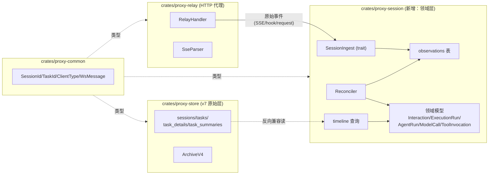
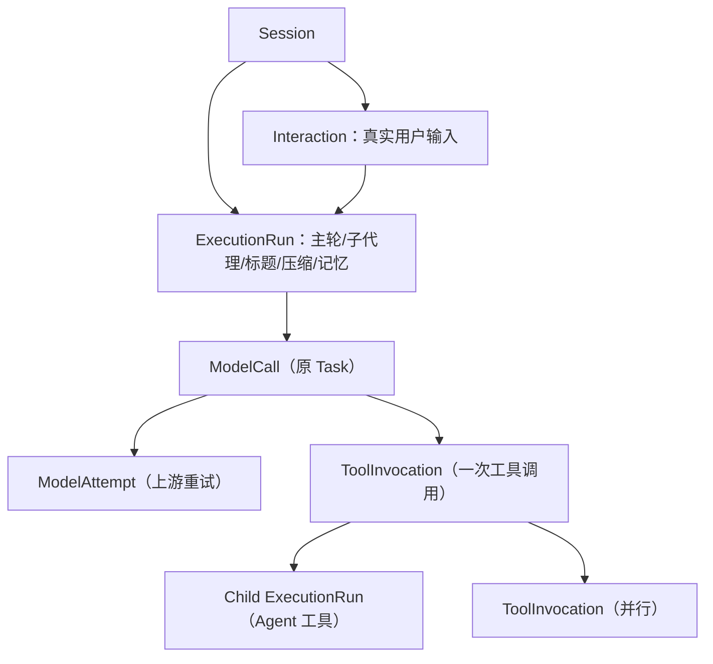
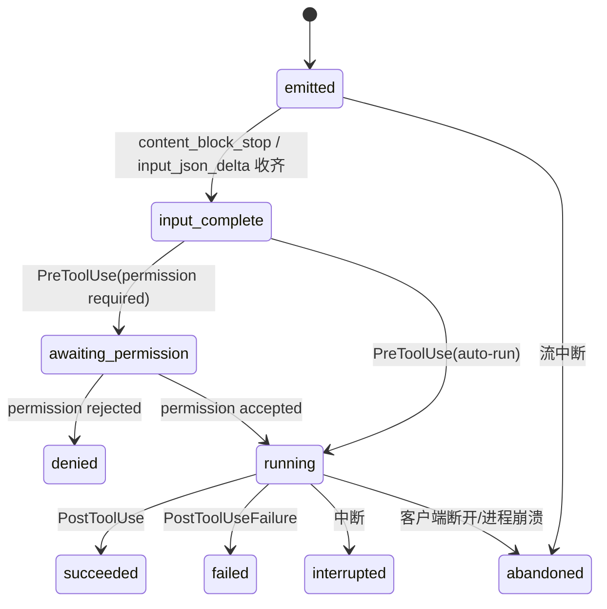

# Session 任务统计（Task 时间线）设计方案 — proxy-session 独立模块版

> 目标：在 Inspector 页面点击 session 时，展示整个 session 内所有 task 的行为
> ——包括**父进程（AgentRun）**、**操作（Operation）**、**生命期 / 下一轮**，并**突出标志用户 prompt**。
>
> 本版依据数据实证 + 两轮评审重构，核心变化：
> ① 从 `proxy-store` / `proxy-relay` **解耦出独立 crate `proxy-session`**；
> ② 领域模型分层 `Interaction / ExecutionRun / AgentRun / ModelCall / Attempt / ToolInvocation`；
> ③ 用 `observations + 幂等 Reconciler` 取代直接写关系表，解决异步/乱序/重复；
> ④ `ClientParser` trait 支持扩展（Claude Code / Codex / 未来其他类型 session）。

---

## 0. 评审结论（数据 + 代码验证）

### 0.1 必须重构的四项（全部成立）

| # | 问题 | 验证 | 本版处理 |
|---|------|------|---------|
| 1 | `active_turn_root_id` 无法并发 | 串行数据无重叠，但存在同刻/消息级并发迹象（seq2/3、47/48、39） | 删除；真实关联用 `prompt.id + agent_id`，启发式仅作兜底 |
| 2 | "最后 assistant_action" ≠ 本轮操作 | seq=5 请求历史=`Read`(上轮)，响应 SSE=`Bash,Bash`(本轮)；seq=4 summary 与两者都不符 | 从**响应 SSE tool_use / hook** 提取，落 `tool_invocations` |
| 3 | 子代理信号不可靠 | 三信号 24/24 零误判（strong），但版本耦合 + 可伪造 | 加 `classification_source/confidence/version`，hook/OTel=exact |
| 4 | 归档后 timeline 丢失 | Archive v3 只存 per-task prompt+summary | 归档升级为 `ArchiveV4`，timeline 统一读 SQLite→归档 |

### 0.2 两处比评审假设更严重的实况

1. **`hook_events` 表不存在**。`migration.rs` 只有 5 张表
   （sessions/tasks/task_details/task_summaries/session_daily_usage）；
   `hook_event` handler 收到 Stop/SessionEnd 只触发 `session_stop` 就返回，
   **hook 原始数据从未落库**。hook 采集需从零建 `observations` 事件表。
2. **`sse_events` 也没有独立表**——存在 `task_details.metadata_json`（cap 4096）。
   工具调用目前只能从 metadata 反查，必须独立成 `tool_invocations`。

### 0.3 架构机会：已有双协议抽象

relay 已有 `ApiProtocol::{Anthropic, Codex}`（`detect_protocol` 按 path 判定，
`message_count` 按 `messages`/`input` 分支）。这是"支持其他类型 session 解析"
的**天然扩展点**，`ClientParser` trait 从它生长。

---

## 1. 解耦架构：独立 crate `proxy-session`

### 1.1 crate 边界



**依赖方向**（单向，无环）：

```
proxy-common  ←  proxy-session  ←  proxy-relay
              ←  proxy-store
```

- **`proxy-common`**：基础类型（不变）。
- **`proxy-session`（新增）**：领域模型 + 事件采集 + Reconciler + 持久化 + timeline 查询。
  依赖 `proxy-common` + `rusqlite`。**不依赖** proxy-relay / proxy-server。
- **`proxy-store`**：保留 v7 表作为**原始记录层**；新增 `ArchiveV4`。依赖 `proxy-common`。
  session 层可读它的窄表做反向兼容，但不反向依赖。
- **`proxy-relay`**：只做 HTTP 代理 + SSE 解析，通过 `SessionIngest` trait 把原始事件
  （`Observation`）交给 proxy-session。**不再直接构造领域对象**。

### 1.2 `proxy-session` 内部模块

```
crates/proxy-session/
  Cargo.toml
  src/
    lib.rs
    domain/                  # 纯领域模型（无 IO，可测试）
      interaction.rs         # Interaction：真实用户输入
      execution_run.rs       # ExecutionRun：主轮/子代理/标题/压缩/记忆
      agent.rs               # AgentIdentity + AgentRun
      model_call.rs          # ModelCall + ModelAttempt
      tool_invocation.rs     # ToolInvocation
      status.rs              # 状态机枚举
      classification.rs      # source/confidence/version
    ingest/                  # 事件采集（扩展点）
      mod.rs                 # SessionIngest trait
      observation.rs         # Observation 类型（追加写）
    pipeline/
      reconciler.rs          # 幂等构造领域模型
      priority.rs            # 关联优先级（5 类，见 §4）
    source/                  # ClientParser trait + 实现（扩展点）
      mod.rs                 # ClientParser trait
      anthropic.rs           # Claude Code parser
      codex.rs               # Codex parser
      hook.rs                # hook 事件 parser
      otel.rs                # OTel span parser
      heuristic.rs           # 正文特征 fallback
    persist/
      schema.rs              # migration（独立于 store）
      repo.rs                # prompt_runs/agent_runs/model_calls/...
    query/
      timeline.rs            # timeline 组装（SQLite→ArchiveV4）
    archive/
      v4.rs                  # ArchiveV4 读写
```

---

## 2. 领域模型



| 实体 | 含义 | 关键字段 |
|------|------|---------|
| **Interaction** | 一次真实用户输入（`prompt.id` 来源） | `external_prompt_id`、`text` |
| **ExecutionRun** | 一次连续执行（主轮/子代理/标题/压缩/记忆） | `run_kind`、`source`、`foreground_completed_at`、`settled_at` |
| **AgentIdentity** | 稳定代理身份 | `external_agent_id`、`agent_type` |
| **AgentRun** | 一次启动或恢复的运行段 | `identity_id`、`run_no`、`parent_agent_run_id`、`spawned_by_tool_invocation_id` |
| **ModelCall** | 一次逻辑 HTTP 请求（原 Task） | `client_request_id`、`provider_request_id`、`previous_task_id`、`prompt_run_id`、`agent_run_id` |
| **ModelAttempt** | 对上游 Provider 的一次尝试（重试） | `call_id`、`attempt_no`、`trace_id`/`span_id` |
| **ToolInvocation** | 一次工具调用 | `tool_use_id`、`operation_seq`、`owner_agent_run_id`、`spawned_agent_run_id`、状态机 |

**内部请求不伪装成 Interaction**：标题/压缩/记忆/recap 用 `ExecutionRun.run_kind` 表示，
`prompt.id` 只指出来源用户 Prompt；`query_source`、Span 类型和分类器区分
`main/compact/title/subagent`。

---

## 3. 数据形态（tmp/1 + tmp/2 实证）

### 3.1 会话构成（tmp/2，129 ModelCall）

```
seq 1     system[]    "Available agent types..."            ← 首次请求（含 tools 定义）
seq 2     user[]      "<session>…Write the title…"           ← title ExecutionRun
seq 3-4   user[]      "<system-reminder>…" + 真实 prompt     ← 用户 Interaction 根
seq 5-128 user[tr]    tool_result 结尾（stream+tools）        ← 主 ExecutionRun 续轮（工具 2→125）
seq 32,… user[]       "<transcript>"（stop_sequences）       ← 子 AgentRun（24 个，穿插）
seq 47   user[]       "<conversation>…# …"                  ← memory ExecutionRun
seq 129  user[]       "The user stepped away…Recap"          ← recap ExecutionRun（灰显）
```

### 3.2 信号与可靠性

| 信号 | 特征 | source | confidence |
|------|------|--------|-----------|
| 主链续轮 | 末条 user 消息含 `tool_result` | protocol | strong |
| 用户 prompt 根 | 末条 user 是真实文本（`is_real_user_prompt`） | protocol/heuristic | strong |
| 子代理 | `<transcript>` + 无 `stream` + `stop_sequence` | heuristic | strong（本数据 24/24） |
| 标题 | `<session>…Write the title…` | heuristic | weak |
| 记忆 | `<conversation>` 开头 | heuristic | weak |
| recap | "The user stepped away…Recap" | heuristic | weak |
| **显式** | hook `prompt_id` / `agent_id` / `tool_use_id` | hook | exact |
| **显式** | OTel `prompt.id`/`agent_id`/`parent_agent_id`/`trace_id` | otel | exact |

---

## 4. 关联模型：五类关联，互不串链

评审正确指出：不同 ID 解决不同问题，不能放在一条优先级链里。拆成 5 类：

### 4.1 ModelCall 关联（HTTP 请求 ↔ OTel 模型调用）

```
trace_id/span_id → client_request_id → request_id → 时间窗口 + model + query_source（弱）
```

### 4.2 Prompt 归组（哪些 ExecutionRun 属于同一次用户输入）

```
prompt.id → UserPromptSubmit prompt_id → 请求正文启发式
```

### 4.3 Agent 归组（哪些 ModelCall 属于哪个 Agent）

```
OTel agent_id → Hook agent_id → transcript_path / request 特征
```

### 4.4 工具调用关联（tool_use ↔ tool_result ↔ hook ↔ OTel）

```
tool_use_id → tool_result.tool_use_id → PreToolUse/PostToolUse → OTel tool_result
```

### 4.5 子代理父子关系

```
OTel parent span / parent_agent_id
  → 父 Agent 工具调用的 tool_use_id
  → PostToolUse(Agent).tool_response.agentId
  → 启发式
```

> 注：`SubagentStart` Hook 输入**没有 `parent_agent_id` 字段**（评审指出，已验证），
> 父子关系只能从 OTel parent span / 父 Agent tool_use_id / PostToolUse agentId 获得。

### 4.6 强制开启 OTel 传播

Proxy 侧为自定义 `ANTHROPIC_BASE_URL` 时，应指示客户端开启：

```bash
CLAUDE_CODE_PROPAGATE_TRACEPARENT=1   # Proxy 直接接收 traceparent
```

这是比正文推断稳定得多的关联方式。

---

## 5. 状态机

### 5.1 ToolInvocation（评审要求：emitted ≠ completed）



要点（评审 + 实测）：
- SSE `content_block_start(tool_use)` 只能拿到 `tool_use_id` + `name`，`input={}`；
- 完整输入来自后续 `input_json_delta`，**必须到 `content_block_stop` 才确认 input_complete**；
- `PreToolUse` 表示即将执行（可改输入）；`PostToolUse` 成功（可改输出）；
- 并行工具调用 `PostToolUse` 并发触发，用 `PostToolBatch` 判定一批完成；
- 需分存 `model_input_preview` / `effective_input_preview` / `raw_result_preview` / `effective_result_preview`（hook 可改写）。

### 5.2 ExecutionRun（完成语义）

`foreground_completed_at` 与 `settled_at` 分离：
- `foreground_completed_at`：用户看到的这一轮主响应结束（首个 Stop 到达）；
- `settled_at`：该 run 派生的全部后台 Agent/Job 终止。

> Stop Hook 可以阻止停止并让 Claude 继续，不能收到首个 Stop 就标 completed。

### 5.3 AgentRun（身份/运行段分离）

- `AgentIdentity`：稳定身份（`external_agent_id`）；
- `AgentRun`：一次启动或恢复后的运行段（`run_no` 递增）；
- 同一个 `agent_id` 可对应多个 AgentRun（恢复机制）；
- 主代理无 `agent_id`：为每个 Session 创建**合成 main AgentIdentity**，
  不能依赖 `agent_id IS NULL` 作为永久身份。

---

## 6. DB 结构（proxy-session 独立 schema）

> 独立于 store 的 5 张表。migration 由 proxy-session 管理（`persist/schema.rs`）。

```sql
-- 追加写事件表（Reconciler 的唯一输入源）
CREATE TABLE observations (
    event_id        TEXT PRIMARY KEY,
    session_id      TEXT NOT NULL,
    source          TEXT NOT NULL,          -- proxy/hook/otel/protocol
    event_type      TEXT NOT NULL,          -- model_call_start/tool_emitted/prompt_submit/agent_start/...
    occurred_at     INTEGER NOT NULL,
    received_at     INTEGER NOT NULL,
    source_sequence TEXT,
    source_version  TEXT,                   -- Claude Code / 分类器版本
    payload_hash    TEXT NOT NULL,
    raw_payload     TEXT NOT NULL,
    model_call_id   TEXT,                   -- 关联线索（可为空，Reconciler 填充）
    agent_id        TEXT,
    prompt_id       TEXT,
    tool_use_id     TEXT
);
CREATE INDEX idx_obs_session_time ON observations(session_id, received_at);
CREATE INDEX idx_obs_source_ref ON observations(source, source_sequence);

CREATE TABLE interactions (
    id                      TEXT PRIMARY KEY,
    session_id              TEXT NOT NULL,
    external_prompt_id      TEXT,
    prompt_text             TEXT,
    started_at              INTEGER NOT NULL,
    ended_at                INTEGER,
    status                  TEXT NOT NULL DEFAULT 'in_progress',
    classification_source   TEXT NOT NULL DEFAULT 'heuristic',
    classification_confidence TEXT NOT NULL DEFAULT 'weak',
    classifier_version      TEXT NOT NULL DEFAULT 'claude-code-v2',
    UNIQUE(session_id, external_prompt_id) WHERE external_prompt_id IS NOT NULL
);

CREATE TABLE execution_runs (
    id                      TEXT PRIMARY KEY,
    session_id              TEXT NOT NULL,
    interaction_id          TEXT,           -- NULL = 内部 run（标题/压缩/记忆/recap）
    run_kind                TEXT NOT NULL,  -- main/subagent/compact/title/memory/recap
    agent_run_id            TEXT,           -- 该 run 的主 AgentRun
    started_at              INTEGER NOT NULL,
    foreground_completed_at INTEGER,
    settled_at              INTEGER,
    status                  TEXT NOT NULL DEFAULT 'in_progress',
    classification_source   TEXT NOT NULL DEFAULT 'heuristic',
    classification_confidence TEXT NOT NULL DEFAULT 'weak'
);

CREATE TABLE agent_identities (
    id                      TEXT PRIMARY KEY,
    session_id              TEXT NOT NULL,
    external_agent_id       TEXT,           -- NULL = 合成 main identity
    agent_type              TEXT NOT NULL DEFAULT 'main',  -- main/claude/explore/general-purpose/...
    synthetic               INTEGER NOT NULL DEFAULT 0,
    UNIQUE(session_id, external_agent_id) WHERE external_agent_id IS NOT NULL
);

CREATE TABLE agent_runs (
    id                      TEXT PRIMARY KEY,
    session_id              TEXT NOT NULL,
    identity_id             TEXT NOT NULL,
    run_no                  INTEGER NOT NULL DEFAULT 1,
    parent_agent_run_id     TEXT,
    spawned_by_tool_invocation_id TEXT,     -- 父 Agent 工具调用
    interaction_id          TEXT,
    started_at              INTEGER NOT NULL,
    ended_at                INTEGER,
    status                  TEXT NOT NULL DEFAULT 'in_progress',
    UNIQUE(identity_id, run_no)
);

-- model_calls 替代原 tasks 的领域语义（物理表名可保留 tasks 兼容）
CREATE TABLE model_calls (
    id                      TEXT PRIMARY KEY,     -- 原 task_id
    session_id              TEXT NOT NULL,
    execution_run_id        TEXT,
    agent_run_id            TEXT,
    interaction_id          TEXT,
    sequence_no             INTEGER NOT NULL,     -- 请求开始顺序（task_start 分配）
    previous_model_call_id  TEXT,                 -- 线性链上一调用
    client_request_id       TEXT,                 -- 非必然存在
    provider_request_id     TEXT,                 -- 上游 message id
    status                  TEXT NOT NULL DEFAULT 'in_progress',  -- in_progress/completed/failed/cancelled/interrupted
    method                  TEXT NOT NULL,
    path                    TEXT NOT NULL,
    requested_model         TEXT,
    resolved_model          TEXT NOT NULL DEFAULT 'unknown',
    provider                TEXT NOT NULL DEFAULT 'unknown',
    upstream                TEXT,
    input_tokens            INTEGER NOT NULL DEFAULT 0,
    output_tokens           INTEGER NOT NULL DEFAULT 0,
    cache_creation_tokens   INTEGER NOT NULL DEFAULT 0,
    cache_read_tokens       INTEGER NOT NULL DEFAULT 0,
    cost_microusd           INTEGER NOT NULL DEFAULT 0,  -- 冻结的执行时价格快照
    duration_ms             INTEGER,
    ttft_ms                 INTEGER,
    stop_reason             TEXT,
    http_status_code        INTEGER,
    error_type              TEXT,
    error_message           TEXT,
    classification_source   TEXT NOT NULL DEFAULT 'heuristic',
    classification_confidence TEXT NOT NULL DEFAULT 'weak',
    UNIQUE(session_id, sequence_no)
);
CREATE INDEX idx_mc_session_seq   ON model_calls(session_id, sequence_no);
CREATE INDEX idx_mc_session_run   ON model_calls(session_id, execution_run_id, sequence_no);
CREATE INDEX idx_mc_client_req    ON model_calls(client_request_id) WHERE client_request_id IS NOT NULL;
CREATE INDEX idx_mc_provider_req  ON model_calls(provider_request_id) WHERE provider_request_id IS NOT NULL;

-- 上游重试（一个 ModelCall 多次 Attempt）
CREATE TABLE model_attempts (
    id                      TEXT PRIMARY KEY,
    model_call_id           TEXT NOT NULL,
    attempt_no              INTEGER NOT NULL,
    trace_id                TEXT,
    span_id                 TEXT,
    started_at              INTEGER NOT NULL,
    ended_at                INTEGER,
    http_status_code        INTEGER,
    error_type              TEXT,
    error_message           TEXT,
    UNIQUE(model_call_id, attempt_no)
);

CREATE TABLE tool_invocations (
    id                      TEXT PRIMARY KEY,      -- 内部 id
    model_call_id           TEXT NOT NULL,
    tool_use_id             TEXT,                  -- 贯通 tool_use/result/hook/OTel
    operation_seq           INTEGER NOT NULL,
    tool_name               TEXT NOT NULL,
    status                  TEXT NOT NULL DEFAULT 'emitted',  -- emitted/input_complete/awaiting_permission/running/succeeded/failed/denied/interrupted/abandoned
    owner_agent_run_id      TEXT,
    spawned_agent_run_id    TEXT,                  -- Agent 工具启动的子 AgentRun
    started_at              INTEGER,
    ended_at                INTEGER,
    duration_ms             INTEGER,
    model_input_preview     TEXT,
    effective_input_preview TEXT,                  -- PreToolUse 可改写
    raw_result_preview      TEXT,
    effective_result_preview TEXT,                 -- PostToolUse 可改写
    UNIQUE(task_id, operation_seq)
);
CREATE INDEX idx_tool_call     ON tool_invocations(model_call_id, operation_seq);
CREATE UNIQUE INDEX idx_tool_use_id ON tool_invocations(tool_use_id) WHERE tool_use_id IS NOT NULL;
CREATE INDEX idx_tool_spawn    ON tool_invocations(spawned_agent_run_id) WHERE spawned_agent_run_id IS NOT NULL;
```

**外键与唯一约束**：评审要求的外键（execution_run_id/agent_run_id → 父表）、
`UNIQUE`、`previous_model_call_id` 自引用均在 schema 中声明。`attempt_count`
不单独维护，由 `model_attempts` 聚合。

**`operations_json`**：保留为**有长度上限的 UI 缓存投影**（每 call ≤20 条），
仅作 timeline 列表加速，**不作为操作事实的唯一存储**——`tool_invocations` 才是事实。

---

## 7. 写入流程：Observation → Reconciler

### 7.1 事件采集（ingest）

`SessionIngest` trait 是 relay → session 的唯一入口：

```rust
// ingest/mod.rs
pub trait SessionIngest: Send + Sync {
    fn record(&self, obs: Observation) -> StoreResult<()>;
    // 批量（并行工具 PostToolBatch 等）
    fn record_many(&self, obs: &[Observation]) -> StoreResult<()>;
}
```

relay 在以下节点产生 `Observation`（**追加写，不直接写关系表**）：

```
请求进入            → Observation::ModelCallStart { call_id, session_id,
                        client_request_id, requested_model, started_at }
接收 SSE            → Observation::ToolEmitted { call_id, tool_use_id, name, seq }
                      Observation::ToolInputDelta { tool_use_id, partial_json }
                      Observation::ToolInputComplete { tool_use_id }
                      Observation::ModelCallFirstToken { call_id, ttft }
请求结束            → Observation::ModelCallEnd { call_id, tokens, stop_reason,
                        cost_microusd, status, ended_at, provider_request_id }
Hook 到达           → Observation::PromptSubmit { prompt_id, ... }
                      Observation::ToolDecision { tool_use_id, action, ... }
                      Observation::AgentStart/Stop { agent_id, agent_type, ... }
                      Observation::ModelCallTelemetry { ... }
OTel 到达           → Observation::OtelSpan { trace_id, span_id, prompt_id,
                        agent_id, parent_agent_id, ... }
```

**采集点**：relay `SseParser` 已在 SSE 解析路径（`handle_streaming_response`），
在 `content_block_start/delta/stop` 处插入 `SessionIngest::record`；
hook 走现有 `/api/hook-event` 路径改为落 `observations` 表。

### 7.2 Reconciler（幂等构造领域模型）

```
observations (追加写, 乱序/重复)
  │
  ▼ Reconciler（幂等，可重跑）
  ├─ 去重：event_id / payload_hash 幂等（重复上报不重复插入）
  ├─ 归组：按 §4 五类关联，把 Observation 归属到
  │     Interaction / ExecutionRun / AgentRun / ModelCall / ToolInvocation
  ├─ 置信度：weak 关系不覆盖 exact；冲突保留证据标 ambiguous
  ├─ 修正：Hook 晚到可修正已有记录（late-arriving）
  └─ 版本：保存 Claude Code 版本 + classifier_version
```

**必须满足（评审要求）**：
- 相同事件重复上报不重复插入；
- weak 不覆盖 exact；
- 冲突关系保留证据并标 `ambiguous`；
- Hook 晚到可修正已有记录；
- 重跑 Reconciler 得相同结果（确定性）。

**触发时机**：每次 `record()` 后增量 reconcile（仅涉及该 event 的最小闭包），
或后台定时批量 reconcile + 启动时全量重跑一次。

### 7.3 ModelCall 生命周期（沿用两段式）

```
进入   → 分配 call_id、sequence_no；INSERT model_calls status=in_progress；
         保存 client_request_id、started_at
SSE    → 写 tool_invocations（emitted→input_complete→running）; 记录 ttft
结束   → UPDATE tokens、stop_reason、cost_microusd、status、ended_at
```

`sequence_no` = 请求开始顺序（task_start 时分配，非 finalize 顺序）——现状已满足。

---

## 8. 归档与恢复

### 8.1 ArchiveV4（统一命名，替代 v2/v3 混淆）

```yaml
version: 4
session: { id, name, client_type, ... }
statistics: { task_count, tokens, cost_microusd(冻结), ... }
interactions:
  - id, external_prompt_id, text, started_at, ended_at, status
    execution_runs:
      - id, run_kind, agent_run_id, foreground_completed_at, settled_at, status
agent_identities: [ { id, external_agent_id, agent_type, synthetic } ]
agent_runs: [ { id, identity_id, run_no, parent_agent_run_id, spawned_by_tool_invocation_id, ... } ]
model_calls:
  - id, sequence_no, execution_run_id, agent_run_id, previous_model_call_id,
    client_request_id, provider_request_id, status, model, provider, upstream,
    usage (token + cost_microusd 冻结), timing, error, prompt, summary
    attempts: [ { attempt_no, trace_id, span_id, status, error } ]
    tool_invocations: [ { tool_use_id, tool_name, status, duration_ms, input_preview, result_preview } ]
daily_usage: [ ... ]
```

- 保留执行时 `cost_microusd` 快照，禁止查询时重算。
- 写入点：`archive_session()`（tasks 未清理前导出完整 timeline）。

### 8.2 恢复后不丢旧时间线

评审给出两方案，本版采用 **方案 B（分段 + 合并读取）**，避免恢复时的昂贵水化：

```text
archive segment 1 → archive segment 2 → live SQLite suffix
API: archived_through_sequence_no 之上合并所有分段 + 实时数据
```

- `sessions` 记录 `archived_through_sequence_no`，标识"归档到哪个 seq 为止"；
- timeline 读取：SQLite 中 `sequence_no > archived_through_sequence_no` 的部分
  + 归档分段中 `<=` 的部分，按 sequence 合并；
- **原子化归档流程**：生成临时文件 → fsync → 原子 rename → 标记 archive_ready → 删 SQLite 明细；
- **归档宽限期**：延迟到达的 Hook/OTel 在宽限期（如 1h）内仍可修改旧时间线，
  宽限期后归档不可变、追加为新 segment。

---

## 9. API 设计

### 9.1 `GET /api/session/:id/timeline`

统一读取 **SQLite → ArchiveV4**（前端不感知双源）。结构：

```json
{
  "session_id": "d01803eb-…",
  "archived_through_sequence_no": 0,
  "total_model_calls": 129,
  "user_interactions": 1,
  "interactions": [
    {
      "id": "in_01", "external_prompt_id": "p_xxx", "prompt_text": "梳理代码，查找错误…",
      "started_at": 1785500000000, "ended_at": 1785512000000, "status": "completed",
      "classification": { "source": "hook", "confidence": "exact" },
      "execution_runs": [
        {
          "id": "er_01", "run_kind": "main",
          "agent_run_id": "ar_01",
          "foreground_completed_at": 1785510000000, "settled_at": 1785512000000,
          "tool_call_count": 125, "task_count": 101,
          "model_calls": [
            {
              "id": "mc_01", "sequence_no": 3, "previous_model_call_id": null,
              "started_at": 1785500000000, "ended_at": 1785500010000,
              "duration_ms": 9000, "status": "completed", "stop_reason": "tool_use",
              "model": "deepseek-v4-flash", "provider": "deepseek",
              "input_tokens": 33059, "output_tokens": 263, "cost_microusd": 4799,
              "tool_invocations": [
                { "tool_use_id": "call_00_…", "tool_name": "Bash", "status": "succeeded",
                  "duration_ms": 8000, "input_preview": "Run: grep -r …" }
              ]
            }
          ]
        },
        { "id": "er_02", "run_kind": "subagent", "parent_agent_run_id": "ar_01", "model_calls": [ /* … */ ] }
      ]
    }
  ]
}
```

- 窄行查询：`model_calls` 窄行 + `tool_invocations`（operation_seq 前缀）+
  `execution_runs`/`interactions` 投影。**不 JOIN** task_details / task_summaries。
- `next_task_id` 仅线性链用 `previous_model_call_id` 推出；有子代理时用 AgentRun 子树，
  **不把 session 画成一条直线**。
- **分页**：按 Interaction 懒加载（`?after_interaction=` 游标），不假设永远 129。

### 9.2 与现有接口的关系

| 接口 | 用途 | 取舍 |
|------|------|------|
| `GET /api/session/:id/summary` | 现有摘要（单 task + session 聚合） | 保留，兼容旧前端/归档回退 |
| `GET /api/session/:id/timeline` | **新增**，点击 session 主视图 | proxy-session 提供 |
| 已归档 session | timeline 读 ArchiveV4（§8.2 合并） | 不丢历史 |

---

## 10. 前端展示（Inspector）

```
点击 session header → selectSession(sid)
  └─ openSessionTimeline(sid)
       ├─ GET /api/session/:id/timeline
       └─ renderSessionTimeline(data) → #summary-content
```

```
┌─ 💬 用户输入 ① "梳理代码，查找错误…"     ← 高亮（Interaction, exact）
│   [主代理 ExecutionRun] 125 工具调用 · 101 task · 共 200s
│   12:50:10  mc3  [op1] Bash  Run: grep -r …     3.3s  33k/0.3k  succeeded  ↓
│   12:50:13  mc4  [op1] Bash  Run: …              2.9s  …         succeeded  ↓
│   …（折叠）
│   [子代理] ⤷ "CLAUDE.md…"  (parent=主代理)     ← 独立子树，灰显
│      12:52:01  mc32 [op0] (输出, stop_sequence)  1.2s  …
├─ ⚙ 系统任务 "Write the title…"                  ← 灰显（run_kind=title, weak）
└─ ⚙ 系统任务 "The user stepped away…"            ← 灰显（run_kind=recap, weak，非用户高亮）
```

**安全**：prompt/operation 用 `textContent` 或统一转义（`esc()`），防 XSS；
输入/文件路径脱敏与长度限制。

**变更文件**：`wwwroot/js/session.js`、`inspector.js`、`i18n.js`、
`assets/zh.json`/`en.json`、CSS。

---

## 11. 兼容性 & 数据回填

1. **旧数据回填**：迁移后存量 model_calls 补 `execution_run_id`/`agent_run_id` 的推断结果，
   **必须标 `classification_source='backfill', confidence='weak'`**，不伪装精确。
2. **capture 双模式**：分类与操作提取基于写入瞬间的完整上下文（body + 响应 SSE），与 capture 无关。
3. **`cost_microusd`**：一切聚合用 model_calls 冻结的执行时成本，禁止重算。
4. **`sse_events` 迁移**：从 `task_details.metadata_json` 反查旧 tool_use 补齐
   `tool_invocations`（backfill + weak）；新数据走 `SessionIngest` 直写。
5. **物理表兼容**：`model_calls` 可映射回原 `tasks` 表（`task_id` 即 call id），
   旧 API 暂时读 store 窄表不破坏。

---

## 12. 实施计划

| 阶段 | 内容 | 位置 |
|------|------|------|
| **P0 领域冻结** | Interaction/ExecutionRun/AgentIdentity/AgentRun/ModelCall/Attempt/ToolInvocation 定义 + 状态机 | `proxy-session/src/domain/` |
| P0 事件采集 | `SessionIngest` trait + `Observation` 追加写 + relay 接入点（SSE content_block 节点） | `proxy-session/src/ingest/`、`proxy-relay/src/upstream.rs`、`sse.rs` |
| P0 Reconciler | 幂等 reconcile + 5 类关联 + 置信度覆盖规则 | `proxy-session/src/pipeline/` |
| P1 持久化 | schema + migration + repo（独立于 store） | `proxy-session/src/persist/` |
| P1 归档 | ArchiveV4 + 分段合并 + 原子写 + 宽限期 | `proxy-session/src/archive/`、`proxy-store` |
| P2 timeline API | SQLite→Archive 合并 + 游标分页 | `proxy-server/src/web/sessions.rs` |
| P2 hook/OTel 采集 | hook 落 observations、OTel traceparent 接收 | proxy-server hook 路径、proxy-session ingest |
| P3 前端 | 树形时间线 + i18n + XSS 防护 | `wwwroot/js/` |

**测试矩阵（评审要求）**：capture ON/OFF、并行工具、两个并行子代理、子代理自己的工具
循环、后台代理跨越下一用户 prompt、非流式回退、重试（model_attempts）、客户端中断、进程
崩溃（recover_interrupted）、归档后读取、恢复后合并、伪造 `<transcript>` 输入、hook 晚到、
重复事件幂等、weak 不覆盖 exact。

**风险与取舍**：
- `observations` 追加写 + Reconciler 增加一层间接，换取乱序/重复/置信度正确性；触发时机
  用"增量最小闭包 + 启动全量重跑"控制成本。
- `model_calls` 与 store 的 `tasks` 物理并存，通过 `task_id=call_id` 兼容，旧 API 不破坏。
- 子代理 `parent_agent_run_id` 优先 hook/OTel exact；无信号时启发式兜底标 weak。
